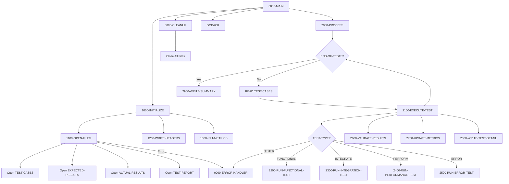

## Overview

TSTVAL00 is a Test Validation Suite that provides automated test execution and validation capabilities for the portfolio management system. It reads test case definitions, executes different types of tests (functional, integration, performance, and error handling), validates results against expected outcomes, and produces a detailed test report with pass/fail metrics.

The program serves as a quality assurance tool supporting the software development lifecycle. It compares actual results against expected results to determine test pass/fail status, tracks cumulative metrics across all test cases, and calculates success rates. This enables consistent, repeatable test execution for regression testing and validation.

TSTVAL00 supports four categories of tests: functional tests for basic feature validation, integration tests for inter-component testing, performance tests for benchmarking, and error tests for negative scenario validation.

## Program Structure



## Data Structures

### File Section - Test Case Record

| Level | Name | Picture | Description |
|-------|------|---------|-------------|
| 01 | TEST-CASE-RECORD | - | Test case definition |
| 05 | TEST-ID | X(10) | Unique test identifier |
| 05 | TEST-TYPE | X(10) | Type: FUNCTIONAL, INTEGRATE, PERFORM, ERROR |
| 05 | TEST-DESCRIPTION | X(50) | Test description |
| 05 | TEST-PARAMETERS | X(100) | Test input parameters |

### File Section - Results Records

| Level | Name | Picture | Description |
|-------|------|---------|-------------|
| 01 | EXPECTED-RECORD | X(200) | Expected test result |
| 01 | ACTUAL-RECORD | X(200) | Actual test result |
| 01 | REPORT-RECORD | X(132) | Output report line |

### Working Storage - File Status

| Level | Name | Picture | Description |
|-------|------|---------|-------------|
| 05 | WS-TEST-STATUS | XX | TEST-CASES file status |
| 05 | WS-EXP-STATUS | XX | EXPECTED-RESULTS file status |
| 05 | WS-ACT-STATUS | XX | ACTUAL-RESULTS file status |
| 05 | WS-RPT-STATUS | XX | TEST-REPORT file status |

### Working Storage - Test Type Constants

| Level | Name | Picture | Value | Description |
|-------|------|---------|-------|-------------|
| 05 | WS-FUNCTIONAL | X(10) | 'FUNCTIONAL' | Functional test type |
| 05 | WS-INTEGRATION | X(10) | 'INTEGRATE' | Integration test type |
| 05 | WS-PERFORMANCE | X(10) | 'PERFORM' | Performance test type |
| 05 | WS-ERROR | X(10) | 'ERROR' | Error handling test type |

### Working Storage - Processing Flags

| Level | Name | Picture | Value | Description |
|-------|------|---------|-------|-------------|
| 05 | WS-END-OF-TESTS | X | 'N' | End-of-file flag |
| - | END-OF-TESTS | 88 | 'Y' | Condition name for EOF |
| 05 | WS-TEST-PASSED | X | 'N' | Current test pass flag |
| - | TEST-PASSED | 88 | 'Y' | Condition name for pass |

### Working Storage - Test Metrics

| Level | Name | Picture | Value | Description |
|-------|------|---------|-------|-------------|
| 05 | WS-TOTAL-TESTS | 9(5) | ZERO | Total tests executed |
| 05 | WS-TESTS-PASSED | 9(5) | ZERO | Tests that passed |
| 05 | WS-TESTS-FAILED | 9(5) | ZERO | Tests that failed |
| 05 | WS-START-TIME | 9(8) | ZERO | Suite start time (HHMMSSCC) |
| 05 | WS-END-TIME | 9(8) | ZERO | Suite end time |
| 05 | WS-ELAPSED-TIME | 9(8) | ZERO | Total elapsed time |

### Working Storage - Report Lines

| Level | Name | Picture | Description |
|-------|------|---------|-------------|
| 05 | WS-HEADER1 | X(132) | Separator line (all asterisks) |
| 05 | WS-HEADER2 | X(132) | Report title "TEST VALIDATION REPORT" |

### Working Storage - Test Detail Line

| Level | Name | Picture | Description |
|-------|------|---------|-------------|
| 05 | WS-TEST-ID-OUT | X(10) | Test ID for report |
| 05 | WS-TEST-TYPE-OUT | X(10) | Test type for report |
| 05 | WS-TEST-DESC-OUT | X(50) | Test description for report |
| 05 | WS-TEST-STATUS-OUT | X(4) | PASS/FAIL status |

### Working Storage - Summary Line

| Level | Name | Picture | Description |
|-------|------|---------|-------------|
| 05 | WS-TOTAL-OUT | ZZ,ZZ9 | Formatted total tests |
| 05 | WS-PASSED-OUT | ZZ,ZZ9 | Formatted passed count |
| 05 | WS-FAILED-OUT | ZZ,ZZ9 | Formatted failed count |
| 05 | WS-SUCCESS-RATE | ZZ9.99 | Success percentage |

### Return Code Area (from RTNCODE copybook)

| Level | Name | Picture | Description |
|-------|------|---------|-------------|
| 01 | RETURN-CODE-AREA | - | Return code management |
| 05 | RC-REQUEST-TYPE | X | Request type (I/S/G/L/A) |
| 05 | RC-PROGRAM-ID | X(8) | Program identifier |
| 05 | RC-CURRENT-CODE | S9(4) COMP | Current return code |
| 05 | RC-HIGHEST-CODE | S9(4) COMP | Highest return code seen |
| 05 | RC-STATUS | X | Status: S/W/E/F |
| 05 | RC-MESSAGE | X(80) | Status message |

## File I/O

### TEST-CASES (Input)

- **Assignment**: TESTCASE
- **Organization**: Sequential
- **Recording Mode**: Fixed
- **File Status**: WS-TEST-STATUS

| Operation | Paragraph | Description |
|-----------|-----------|-------------|
| OPEN INPUT | 1100-OPEN-FILES | Opens for reading test definitions |
| READ | 2000-PROCESS | Reads next test case |
| CLOSE | 3000-CLEANUP | Closes after all tests |

### EXPECTED-RESULTS (Input)

- **Assignment**: EXPECTED
- **Organization**: Sequential
- **Recording Mode**: Fixed
- **File Status**: WS-EXP-STATUS

| Operation | Paragraph | Description |
|-----------|-----------|-------------|
| OPEN INPUT | 1100-OPEN-FILES | Opens expected results file |
| READ | 2600-VALIDATE-RESULTS | Reads expected outcome |
| CLOSE | 3000-CLEANUP | Closes after validation |

### ACTUAL-RESULTS (Input)

- **Assignment**: ACTUAL
- **Organization**: Sequential
- **Recording Mode**: Fixed
- **File Status**: WS-ACT-STATUS

| Operation | Paragraph | Description |
|-----------|-----------|-------------|
| OPEN INPUT | 1100-OPEN-FILES | Opens actual results file |
| READ | 2600-VALIDATE-RESULTS | Reads actual outcome |
| CLOSE | 3000-CLEANUP | Closes after validation |

### TEST-REPORT (Output)

- **Assignment**: TESTRPT
- **Organization**: Sequential
- **Recording Mode**: Fixed (132 bytes)
- **File Status**: WS-RPT-STATUS

| Operation | Paragraph | Description |
|-----------|-----------|-------------|
| OPEN OUTPUT | 1100-OPEN-FILES | Opens for report writing |
| WRITE | 1200-WRITE-HEADERS | Writes report headers |
| WRITE | 2800-WRITE-TEST-DETAIL | Writes test result line |
| WRITE | 2900-WRITE-SUMMARY | Writes summary totals |
| CLOSE | 3000-CLEANUP | Closes report file |

## Control Flow

### 0000-MAIN - Main Control

Orchestrates the test validation process:
1. Calls 1000-INITIALIZE for setup
2. Calls 2000-PROCESS to run all tests
3. Calls 3000-CLEANUP for file closure
4. Returns via GOBACK

### 1000-INITIALIZE - Setup

Prepares the test environment:
1. **1100-OPEN-FILES**: Opens all four files (test cases, expected, actual, report)
2. **1200-WRITE-HEADERS**: Writes report header lines
3. **1300-INIT-METRICS**: Initializes counters and captures start time

### 1100-OPEN-FILES - File Opening

Opens all required files with error handling:
- Opens TEST-CASES for input
- Opens EXPECTED-RESULTS for input
- Opens ACTUAL-RESULTS for input
- Opens TEST-REPORT for output
- Calls 9999-ERROR-HANDLER if any open fails

### 1200-WRITE-HEADERS - Report Header

Writes the report header section:
1. Writes WS-HEADER1 (asterisk separator line)
2. Writes WS-HEADER2 (centered title "TEST VALIDATION REPORT")

### 1300-INIT-METRICS - Metrics Initialization

Initializes test tracking:
1. Clears all metrics in WS-TEST-METRICS to zeros
2. Captures start time using `ACCEPT WS-START-TIME FROM TIME`

### 2000-PROCESS - Main Processing Loop

Executes all test cases:
1. Loops until END-OF-TESTS is true
2. Reads each TEST-CASE-RECORD
3. Sets END-OF-TESTS on AT END condition
4. Calls 2100-EXECUTE-TEST for each record
5. After loop, calls 2900-WRITE-SUMMARY

### 2100-EXECUTE-TEST - Test Execution Router

Routes tests based on TEST-TYPE:

| TEST-TYPE | Paragraph Called |
|-----------|------------------|
| FUNCTIONAL | 2200-RUN-FUNCTIONAL-TEST |
| INTEGRATE | 2300-RUN-INTEGRATION-TEST |
| PERFORM | 2400-RUN-PERFORMANCE-TEST |
| ERROR | 2500-RUN-ERROR-TEST |
| Other | 9999-ERROR-HANDLER |

After test execution:
1. Calls 2600-VALIDATE-RESULTS to compare expected vs actual
2. Calls 2700-UPDATE-METRICS to update pass/fail counters
3. Calls 2800-WRITE-TEST-DETAIL to write result to report

### 2200-RUN-FUNCTIONAL-TEST

Executes functional tests - validates basic feature behavior and business logic.

### 2300-RUN-INTEGRATION-TEST

Executes integration tests - validates inter-component communication and data flow.

### 2400-RUN-PERFORMANCE-TEST

Executes performance tests - validates response times and throughput benchmarks.

### 2500-RUN-ERROR-TEST

Executes error handling tests - validates proper handling of invalid inputs and error conditions.

### 2600-VALIDATE-RESULTS

Compares actual results against expected results to determine pass/fail status. Sets the TEST-PASSED flag accordingly.

### 2700-UPDATE-METRICS

Updates test counters:
- Increments WS-TOTAL-TESTS
- If TEST-PASSED: Increments WS-TESTS-PASSED
- Otherwise: Increments WS-TESTS-FAILED

### 2800-WRITE-TEST-DETAIL

Writes a detail line to the report for the current test case, including test ID, type, description, and PASS/FAIL status.

### 2900-WRITE-SUMMARY - Summary Generation

Produces the test summary:
1. Captures end time using `ACCEPT WS-END-TIME FROM TIME`
2. Computes elapsed time: `WS-END-TIME - WS-START-TIME`
3. Moves metrics to output fields
4. Computes success rate: `(WS-TESTS-PASSED / WS-TOTAL-TESTS) * 100`
5. Writes WS-SUMMARY-LINE to report

### 3000-CLEANUP - File Closure

Closes all four files:
- TEST-CASES
- EXPECTED-RESULTS
- ACTUAL-RESULTS
- TEST-REPORT

### 9999-ERROR-HANDLER - Error Handling

Handles fatal errors:
1. Displays WS-ERROR-MESSAGE to console (CONS)
2. Sets RETURN-CODE to 12
3. Terminates via GOBACK

## Report Layout

The TEST-REPORT output has a 132-character fixed format:

```
************************************************************************...
                              TEST VALIDATION REPORT
TEST001    FUNCTIONAL  Verify account creation                          PASS
TEST002    FUNCTIONAL  Validate balance calculation                     PASS
TEST003    INTEGRATE   Test DB2 connection handling                     FAIL
TEST004    PERFORM     Benchmark transaction throughput                 PASS
TEST005    ERROR       Invalid account number handling                  PASS
...
TOTAL TESTS: 5     PASSED: 4     FAILED: 1     SUCCESS: 80.00%
```

## Test Types

| Type | Constant | Purpose |
|------|----------|---------|
| FUNCTIONAL | 'FUNCTIONAL' | Unit/feature testing - validates individual functions work correctly |
| INTEGRATE | 'INTEGRATE' | Integration testing - validates components work together |
| PERFORM | 'PERFORM' | Performance testing - validates system meets performance requirements |
| ERROR | 'ERROR' | Negative testing - validates proper handling of error conditions |

## Dependencies

### Copybooks

| Copybook | Section | Description |
|----------|---------|-------------|
| RTNCODE | WORKING-STORAGE | Return code management structure |
| ERRHAND | WORKING-STORAGE | Error handling definitions |

### Called Programs

This program does not call external programs. Test execution is handled internally.

### Related Programs

Programs that share copybooks with TSTVAL00:

- **TSTGEN00** - Test data generator (uses RTNCODE, ERRHAND)
- **RPTAUD00** - Audit report program (uses RTNCODE, ERRHAND)
- **RPTPOS00** - Position report program (uses RTNCODE, ERRHAND)
- **RPTSTA00** - Status report program (uses RTNCODE, ERRHAND)
- **RTNCDE00** - Return code manager (uses RTNCODE)
- **UTLMNT00** - Maintenance utility (uses RTNCODE, ERRHAND)
- **UTLMON00** - Monitoring utility (uses RTNCODE, ERRHAND)
- **UTLVAL00** - Validation utility (uses RTNCODE, ERRHAND)

## Return Codes

| Code | Meaning |
|------|---------|
| 0 | All tests completed (check report for pass/fail) |
| 12 | Fatal error (file open failure, invalid test type) |

## JCL Example

```jcl
//TSTVAL00 EXEC PGM=TSTVAL00
//STEPLIB  DD  DSN=your.loadlib,DISP=SHR
//TESTCASE DD  DSN=your.test.cases,DISP=SHR
//EXPECTED DD  DSN=your.expected.results,DISP=SHR
//ACTUAL   DD  DSN=your.actual.results,DISP=SHR
//TESTRPT  DD  SYSOUT=*
//SYSOUT   DD  SYSOUT=*
```

## Test Case File Format

Each test case record should contain:

| Field | Position | Length | Description |
|-------|----------|--------|-------------|
| TEST-ID | 1-10 | 10 | Unique identifier (e.g., "TEST001") |
| TEST-TYPE | 11-20 | 10 | FUNCTIONAL, INTEGRATE, PERFORM, or ERROR |
| TEST-DESCRIPTION | 21-70 | 50 | Human-readable description |
| TEST-PARAMETERS | 71-170 | 100 | Input parameters for test execution |

## Technical Notes

- **SPECIAL-NAMES CONSOLE IS CONS**: Defines CONS as an alias for console output, used in error handler
- **ACCEPT FROM TIME**: Retrieves system time in HHMMSSCC format (hours, minutes, seconds, centiseconds)
- **88-Level Conditions**: Uses END-OF-TESTS and TEST-PASSED for readable flag checking
- **Edited Pictures**: Summary uses ZZ,ZZ9 for zero-suppression with comma insertion
- **Success Rate Calculation**: Computes percentage as `(passed / total) * 100`
- **RECORDING MODE F**: Fixed-length records for all files
- **BLOCK CONTAINS 0**: System-determined blocking for all files

## Testing Workflow

1. **Prepare Test Cases**: Create TESTCASE file with test definitions
2. **Generate Expected Results**: Create EXPECTED file with anticipated outcomes
3. **Execute System Under Test**: Run the programs being tested to produce ACTUAL results
4. **Run TSTVAL00**: Execute validation suite to compare actual vs expected
5. **Review Report**: Examine TESTRPT for pass/fail status and success rate
6. **Investigate Failures**: For failed tests, compare EXPECTED and ACTUAL records
