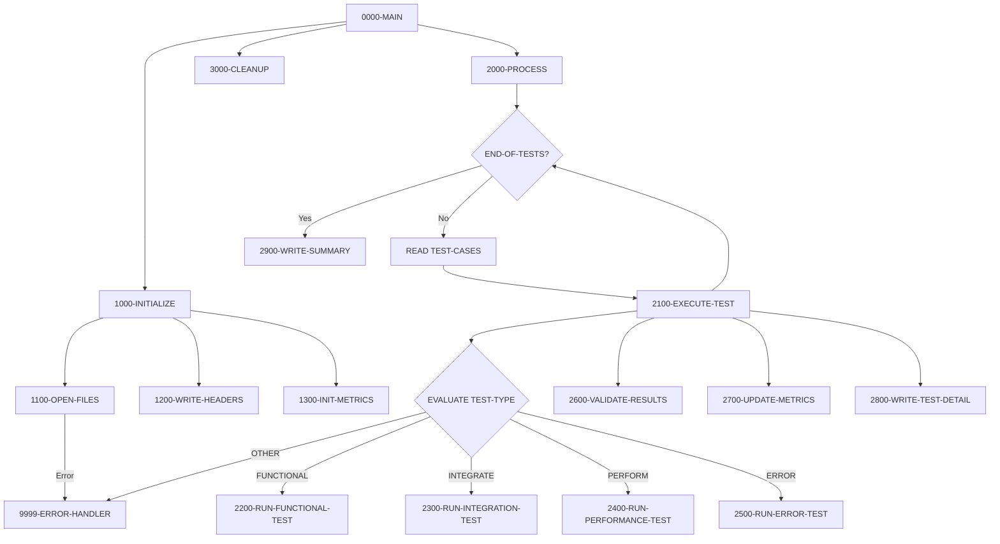

## Overview

TSTVAL00 is a test validation program that executes a suite of test cases and validates their results against expected outcomes. It supports multiple test types including functional tests, integration tests, performance benchmarks, and error condition tests. The program produces a detailed test report showing individual test results and aggregate statistics.

This program is a core component of the quality assurance infrastructure, enabling automated regression testing and validation of system behavior. It reads test case definitions from an input file, compares actual results against expected results, and generates a comprehensive test report with pass/fail metrics and success rates.

Key capabilities include:
- **Test Execution**: Runs functional, integration, performance, and error tests
- **Result Validation**: Compares actual outputs against expected results
- **Metrics Tracking**: Counts passed/failed tests and calculates success rate
- **Report Generation**: Produces formatted test reports with individual and summary results

## Program Structure



## Data Structures

### File Status Variables

| Level | Name | Picture | Description |
|-------|------|---------|-------------|
| 05 | WS-TEST-STATUS | XX | File status for test cases file |
| 05 | WS-EXP-STATUS | XX | File status for expected results file |
| 05 | WS-ACT-STATUS | XX | File status for actual results file |
| 05 | WS-RPT-STATUS | XX | File status for test report file |

### Test Type Constants

| Level | Name | Picture | Value | Description |
|-------|------|---------|-------|-------------|
| 05 | WS-FUNCTIONAL | X(10) | 'FUNCTIONAL' | Functional test type identifier |
| 05 | WS-INTEGRATION | X(10) | 'INTEGRATE' | Integration test type identifier |
| 05 | WS-PERFORMANCE | X(10) | 'PERFORM' | Performance test type identifier |
| 05 | WS-ERROR | X(10) | 'ERROR' | Error condition test type identifier |

### Processing Flags

| Level | Name | Picture | Value | 88-Level | Description |
|-------|------|---------|-------|----------|-------------|
| 05 | WS-END-OF-TESTS | X | 'N' | END-OF-TESTS = 'Y' | End of test file indicator |
| 05 | WS-TEST-PASSED | X | 'N' | TEST-PASSED = 'Y' | Current test pass/fail flag |

### Test Metrics

| Level | Name | Picture | Value | Description |
|-------|------|---------|-------|-------------|
| 05 | WS-TOTAL-TESTS | 9(5) | ZERO | Total number of tests executed |
| 05 | WS-TESTS-PASSED | 9(5) | ZERO | Number of tests that passed |
| 05 | WS-TESTS-FAILED | 9(5) | ZERO | Number of tests that failed |
| 05 | WS-START-TIME | 9(8) | ZERO | Test suite start time (HHMMSSCC) |
| 05 | WS-END-TIME | 9(8) | ZERO | Test suite end time (HHMMSSCC) |
| 05 | WS-ELAPSED-TIME | 9(8) | ZERO | Total elapsed time |

### Test Detail Line

| Level | Name | Picture | Description |
|-------|------|---------|-------------|
| 05 | WS-TEST-ID-OUT | X(10) | Test identifier |
| 05 | WS-TEST-TYPE-OUT | X(10) | Test type |
| 05 | WS-TEST-DESC-OUT | X(50) | Test description |
| 05 | WS-TEST-STATUS-OUT | X(4) | Pass/Fail status |

### Summary Line

| Level | Name | Picture | Description |
|-------|------|---------|-------------|
| 05 | WS-TOTAL-OUT | ZZ,ZZ9 | Formatted total tests count |
| 05 | WS-PASSED-OUT | ZZ,ZZ9 | Formatted passed tests count |
| 05 | WS-FAILED-OUT | ZZ,ZZ9 | Formatted failed tests count |
| 05 | WS-SUCCESS-RATE | ZZ9.99 | Success rate percentage |

### Test Case Record (File Section)

| Level | Name | Picture | Description |
|-------|------|---------|-------------|
| 05 | TEST-ID | X(10) | Unique test identifier |
| 05 | TEST-TYPE | X(10) | Type: FUNCTIONAL, INTEGRATE, PERFORM, ERROR |
| 05 | TEST-DESCRIPTION | X(50) | Human-readable test description |
| 05 | TEST-PARAMETERS | X(100) | Test input parameters |

### Return Code Area (from RTNCODE copybook)

| Level | Name | Picture | Description |
|-------|------|---------|-------------|
| 05 | RC-REQUEST-TYPE | X | I=Initialize, S=Set, G=Get, L=Log, A=Analyze |
| 05 | RC-PROGRAM-ID | X(8) | Program identifier |
| 10 | RC-CURRENT-CODE | S9(4) COMP | Current return code |
| 10 | RC-HIGHEST-CODE | S9(4) COMP | Highest return code seen |
| 10 | RC-STATUS | X | S=Success, W=Warning, E=Error, F=Severe |
| 05 | RC-MESSAGE | X(80) | Status message |

## File I/O

### TEST-CASES (Input)

| Attribute | Value |
|-----------|-------|
| DDname | TESTCASE |
| Organization | Sequential |
| Access Mode | Sequential |
| Recording Mode | Fixed |
| File Status | WS-TEST-STATUS |
| Record Length | 170 bytes |

**Contents**: Test case definitions with ID, type, description, and parameters.

### EXPECTED-RESULTS (Input)

| Attribute | Value |
|-----------|-------|
| DDname | EXPECTED |
| Organization | Sequential |
| Access Mode | Sequential |
| Recording Mode | Fixed |
| File Status | WS-EXP-STATUS |
| Record Length | 200 bytes |

**Contents**: Expected output values for each test case.

### ACTUAL-RESULTS (Input)

| Attribute | Value |
|-----------|-------|
| DDname | ACTUAL |
| Organization | Sequential |
| Access Mode | Sequential |
| Recording Mode | Fixed |
| File Status | WS-ACT-STATUS |
| Record Length | 200 bytes |

**Contents**: Actual output values produced by the system under test.

### TEST-REPORT (Output)

| Attribute | Value |
|-----------|-------|
| DDname | TESTRPT |
| Organization | Sequential |
| Access Mode | Sequential |
| Recording Mode | Fixed |
| File Status | WS-RPT-STATUS |
| Record Length | 132 bytes |

**Contents**: Formatted test validation report.

## Control Flow

### 0000-MAIN

Main control paragraph:
1. Performs 1000-INITIALIZE to set up environment
2. Performs 2000-PROCESS to execute all tests
3. Performs 3000-CLEANUP to close files
4. Returns via GOBACK

### 1000-INITIALIZE

Prepares the test environment:
1. **1100-OPEN-FILES**: Opens all four files, handling errors
2. **1200-WRITE-HEADERS**: Writes report header lines
3. **1300-INIT-METRICS**: Initializes counters and captures start time

### 1100-OPEN-FILES

Opens all required files with error handling:
1. Opens TEST-CASES for input
2. Opens EXPECTED-RESULTS for input
3. Opens ACTUAL-RESULTS for input
4. Opens TEST-REPORT for output
5. For each file, checks status and calls 9999-ERROR-HANDLER if open fails

### 1200-WRITE-HEADERS

Writes report header:
1. Writes asterisk border line
2. Writes centered "TEST VALIDATION REPORT" title

### 1300-INIT-METRICS

Initializes test tracking:
1. Initializes WS-TEST-METRICS to zeros
2. Captures start time using `ACCEPT WS-START-TIME FROM TIME`

### 2000-PROCESS

Main processing loop:
1. Reads test cases until end of file
2. For each test case, performs 2100-EXECUTE-TEST
3. Sets END-OF-TESTS flag when file exhausted
4. After all tests, performs 2900-WRITE-SUMMARY

### 2100-EXECUTE-TEST

Executes a single test based on type:
1. **EVALUATE TEST-TYPE**:
   - FUNCTIONAL → 2200-RUN-FUNCTIONAL-TEST
   - INTEGRATE → 2300-RUN-INTEGRATION-TEST
   - PERFORM → 2400-RUN-PERFORMANCE-TEST
   - ERROR → 2500-RUN-ERROR-TEST
   - OTHER → Error handler
2. Performs 2600-VALIDATE-RESULTS
3. Performs 2700-UPDATE-METRICS
4. Performs 2800-WRITE-TEST-DETAIL

### 2200-RUN-FUNCTIONAL-TEST

Executes functional tests that verify specific business logic or feature behavior.
*(Implementation stub - actual test logic to be added)*

### 2300-RUN-INTEGRATION-TEST

Executes integration tests that verify component interactions.
*(Implementation stub - actual test logic to be added)*

### 2400-RUN-PERFORMANCE-TEST

Executes performance benchmarks measuring execution time and throughput.
*(Implementation stub - actual test logic to be added)*

### 2500-RUN-ERROR-TEST

Executes error condition tests verifying proper error handling.
*(Implementation stub - actual test logic to be added)*

### 2600-VALIDATE-RESULTS

Compares actual results against expected results to determine pass/fail status.
*(Implementation stub - comparison logic to be added)*

### 2700-UPDATE-METRICS

Updates test counters based on pass/fail outcome.
*(Implementation stub - metric update logic to be added)*

### 2800-WRITE-TEST-DETAIL

Writes individual test result to the report.
*(Implementation stub - detail line writing to be added)*

### 2900-WRITE-SUMMARY

Writes test summary at end of report:
1. Captures end time
2. Computes elapsed time
3. Moves metrics to output fields
4. Computes success rate: `(WS-TESTS-PASSED / WS-TOTAL-TESTS) * 100`
5. Writes summary line to report

### 3000-CLEANUP

Closes all files:
1. Closes TEST-CASES
2. Closes EXPECTED-RESULTS
3. Closes ACTUAL-RESULTS
4. Closes TEST-REPORT

### 9999-ERROR-HANDLER

Handles fatal errors:
1. Displays error message to console (CONS)
2. Sets RETURN-CODE to 12
3. Exits program via GOBACK

## Test Types

| Type | Constant | Description |
|------|----------|-------------|
| Functional | FUNCTIONAL | Tests specific features or business logic in isolation |
| Integration | INTEGRATE | Tests interactions between system components |
| Performance | PERFORM | Benchmarks execution speed and resource usage |
| Error | ERROR | Verifies proper handling of error conditions |

## Report Output Format

```
************************************************************************
                         TEST VALIDATION REPORT
************************************************************************
TEST0001   FUNCTIONAL  Validate account creation               PASS
TEST0002   INTEGRATE   Test portfolio-transaction flow         PASS
TEST0003   PERFORM     Benchmark bulk insert performance       PASS
TEST0004   ERROR       Verify invalid input handling           FAIL
...
TOTAL TESTS: 1,234  PASSED: 1,200  FAILED:    34  SUCCESS: 97.24%
```

## Return Codes

| Code | Meaning |
|------|---------|
| 0 | All tests completed (check report for pass/fail) |
| 12 | Fatal error (file open failure, invalid test type) |

## Dependencies

### Copybooks

- **RTNCODE** - Return code management structure for tracking test execution status
- **ERRHAND** - Standard error handling definitions including WS-ERROR-MESSAGE

### Called Programs

None - this is a standalone test execution program.

### Related Programs

Programs that use the same copybooks:
- TSTGEN00 - Test data generator (uses RTNCODE, ERRHAND)
- RPTAUD00 - Audit report (uses RTNCODE, ERRHAND)
- RPTPOS00 - Position report (uses RTNCODE, ERRHAND)
- RPTSTA00 - Status report (uses RTNCODE, ERRHAND)
- RTNCDE00 - Return code processor (uses RTNCODE)
- UTLMNT00 - Maintenance utility (uses RTNCODE, ERRHAND)
- UTLMON00 - Monitoring utility (uses RTNCODE, ERRHAND)
- UTLVAL00 - Validation utility (uses RTNCODE, ERRHAND)

## JCL Example

```jcl
//TSTVAL00 JOB (ACCT),'TEST VALIDATION',
//             CLASS=A,MSGCLASS=X
//*
//VALIDATE EXEC PGM=TSTVAL00
//STEPLIB  DD DSN=TEST.LOAD.LIBRARY,DISP=SHR
//TESTCASE DD DSN=TEST.CASES.FILE,DISP=SHR
//EXPECTED DD DSN=TEST.EXPECTED.RESULTS,DISP=SHR
//ACTUAL   DD DSN=TEST.ACTUAL.RESULTS,DISP=SHR
//TESTRPT  DD SYSOUT=*,
//            DCB=(RECFM=FBA,LRECL=132,BLKSIZE=0)
//SYSOUT   DD SYSOUT=*
```

## Test Case File Format

Each test case record contains:

| Position | Length | Field | Description |
|----------|--------|-------|-------------|
| 1-10 | 10 | TEST-ID | Unique test identifier |
| 11-20 | 10 | TEST-TYPE | FUNCTIONAL, INTEGRATE, PERFORM, or ERROR |
| 21-70 | 50 | TEST-DESCRIPTION | Human-readable description |
| 71-170 | 100 | TEST-PARAMETERS | Input parameters for test execution |

## Technical Notes

1. **SPECIAL-NAMES CONSOLE**: Uses `CONSOLE IS CONS` to define a mnemonic name for the system console, enabling `DISPLAY ... UPON CONS` for operator messages

2. **ACCEPT FROM TIME**: Retrieves system time in HHMMSSCC format (hours, minutes, seconds, centiseconds) for elapsed time calculation

3. **88-Level Conditions**: Uses condition names (END-OF-TESTS, TEST-PASSED) for readable control flow in PERFORM UNTIL and IF statements

4. **EVALUATE Statement**: Provides structured case selection for test type routing, with OTHER clause handling invalid types

5. **Edited Pictures**: Uses ZZ,ZZ9 for numeric output with zero suppression and comma insertion, and ZZ9.99 for percentage display

6. **RECORDING MODE F**: Specifies fixed-length records for all files, ensuring consistent record sizes

7. **BLOCK CONTAINS 0**: Lets the system determine optimal block size based on device characteristics

8. **Elapsed Time Calculation**: Simple subtraction of start from end time works for same-day execution; cross-midnight runs would need adjustment
