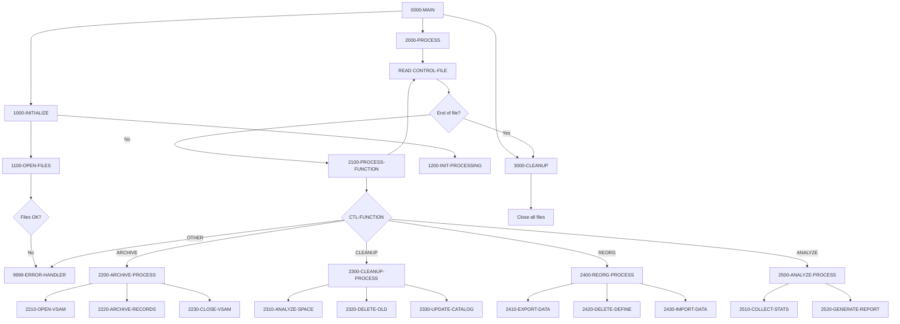
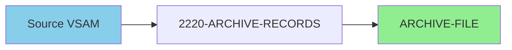
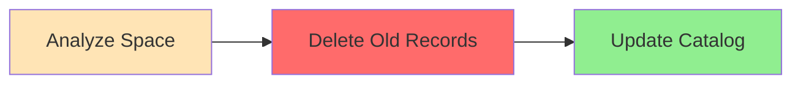
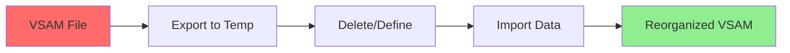
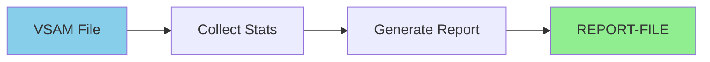

## Overview

UTLMNT00 is a file maintenance utility program that provides essential housekeeping operations for system files, particularly VSAM datasets. The program is control-file driven, reading maintenance requests and executing the appropriate function for each specified file.

The utility supports four primary maintenance functions:
- **ARCHIVE** - Archives records from VSAM files to sequential archive datasets
- **CLEANUP** - Analyzes space utilization and removes obsolete data
- **REORG** - Reorganizes VSAM files by exporting, deleting/redefining, and reimporting data
- **ANALYZE** - Collects statistics and generates space/utilization reports

This utility is typically run as part of scheduled batch maintenance windows to ensure optimal file performance and storage efficiency.

## Program Structure



## Data Structures

### File Section

#### CONTROL-RECORD

| Level | Name | Picture | Description |
|-------|------|---------|-------------|
| 01 | CONTROL-RECORD | - | Control file input record |
| 05 | CTL-FUNCTION | X(8) | Maintenance function to perform |
| 05 | CTL-FILE-NAME | X(44) | Target dataset name |
| 05 | CTL-PARAMETERS | X(100) | Function-specific parameters |

#### ARCHIVE-RECORD

| Level | Name | Picture | Description |
|-------|------|---------|-------------|
| 01 | ARCHIVE-RECORD | X(32760) | Variable-length archive record |

#### REPORT-RECORD

| Level | Name | Picture | Description |
|-------|------|---------|-------------|
| 01 | REPORT-RECORD | X(132) | Fixed-length report line |

### Working Storage

#### WS-FILE-STATUS

| Level | Name | Picture | Description |
|-------|------|---------|-------------|
| 01 | WS-FILE-STATUS | - | File status group |
| 05 | WS-CTL-STATUS | XX | Control file status |
| 05 | WS-ARCH-STATUS | XX | Archive file status |
| 05 | WS-REPORT-STATUS | XX | Report file status |

#### WS-PROCESSING-FLAGS

| Level | Name | Picture | Initial | Description |
|-------|------|---------|---------|-------------|
| 01 | WS-PROCESSING-FLAGS | - | - | Processing control flags |
| 05 | WS-END-OF-CTL | X | 'N' | End of control file flag |
| 05 | WS-FUNCTION-FLAG | X | 'N' | Valid function flag |

##### WS-END-OF-CTL Condition Names

| Condition | Value | Description |
|-----------|-------|-------------|
| END-OF-CONTROL | 'Y' | End of control file reached |

##### WS-FUNCTION-FLAG Condition Names

| Condition | Value | Description |
|-----------|-------|-------------|
| VALID-FUNCTION | 'Y' | Function code is valid |

#### WS-FUNCTIONS

| Level | Name | Picture | Value | Description |
|-------|------|---------|-------|-------------|
| 01 | WS-FUNCTIONS | - | - | Valid function codes |
| 05 | WS-ARCHIVE | X(8) | 'ARCHIVE' | Archive function code |
| 05 | WS-CLEANUP | X(8) | 'CLEANUP' | Cleanup function code |
| 05 | WS-REORG | X(8) | 'REORG' | Reorganization function code |
| 05 | WS-ANALYZE | X(8) | 'ANALYZE' | Analysis function code |

#### WS-COUNTERS

| Level | Name | Picture | Initial | Description |
|-------|------|---------|---------|-------------|
| 01 | WS-COUNTERS | - | - | Processing counters |
| 05 | WS-RECORDS-READ | 9(9) | ZERO | Records read from source |
| 05 | WS-RECORDS-WRITTEN | 9(9) | ZERO | Records written to target |
| 05 | WS-ERROR-COUNT | 9(9) | ZERO | Errors encountered |

#### WS-VSAM-CONTROL

| Level | Name | Picture | Description |
|-------|------|---------|-------------|
| 01 | WS-VSAM-CONTROL | - | VSAM operation control |
| 05 | WS-VSAM-NAME | X(44) | VSAM dataset name |
| 05 | WS-VSAM-FUNCTION | X(8) | Current VSAM function |
| 05 | WS-VSAM-STATUS | XX | VSAM operation status |

## File I/O

### CONTROL-FILE

| Attribute | Value |
|-----------|-------|
| DD Name | CTLFILE |
| Organization | SEQUENTIAL |
| Access Mode | SEQUENTIAL |
| Recording Mode | F (Fixed) |
| Block Contains | 0 (System determined) |
| File Status | WS-CTL-STATUS |
| Open Mode | INPUT |

**Operations:**
- **READ** - Reads maintenance control records

### ARCHIVE-FILE

| Attribute | Value |
|-----------|-------|
| DD Name | ARCHFILE |
| Organization | SEQUENTIAL |
| Access Mode | SEQUENTIAL |
| Recording Mode | V (Variable) |
| Block Contains | 0 (System determined) |
| File Status | WS-ARCH-STATUS |
| Open Mode | OUTPUT |

**Operations:**
- **WRITE** - Writes archived records

### REPORT-FILE

| Attribute | Value |
|-----------|-------|
| DD Name | RPTFILE |
| Organization | SEQUENTIAL |
| Recording Mode | F (Fixed) |
| File Status | WS-REPORT-STATUS |
| Open Mode | OUTPUT |

**Operations:**
- **WRITE** - Writes report lines

## Control Flow

### 0000-MAIN

Main driver paragraph:
1. Performs 1000-INITIALIZE
2. Performs 2000-PROCESS
3. Performs 3000-CLEANUP
4. Returns via GOBACK

### 1000-INITIALIZE

Initializes the program environment:
1. **1100-OPEN-FILES**: Opens all required files
2. **1200-INIT-PROCESSING**: Initializes counters

### 1100-OPEN-FILES

Opens all files with error checking:
1. Opens CONTROL-FILE for INPUT
2. Opens ARCHIVE-FILE for OUTPUT
3. Opens REPORT-FILE for OUTPUT
4. Calls 9999-ERROR-HANDLER if any file fails to open

### 2000-PROCESS

Main processing loop:
1. Reads CONTROL-FILE until END-OF-CONTROL
2. For each control record, calls 2100-PROCESS-FUNCTION

### 2100-PROCESS-FUNCTION

Function dispatcher based on CTL-FUNCTION:

| Function | Handler | Description |
|----------|---------|-------------|
| ARCHIVE | 2200-ARCHIVE-PROCESS | Archive old records |
| CLEANUP | 2300-CLEANUP-PROCESS | Clean up file space |
| REORG | 2400-REORG-PROCESS | Reorganize VSAM file |
| ANALYZE | 2500-ANALYZE-PROCESS | Analyze and report |
| Other | 9999-ERROR-HANDLER | Invalid function error |

### 2200-ARCHIVE-PROCESS

Archives records from a VSAM file:
1. **2210-OPEN-VSAM**: Opens the source VSAM file
2. **2220-ARCHIVE-RECORDS**: Copies records to archive file
3. **2230-CLOSE-VSAM**: Closes the VSAM file

### 2300-CLEANUP-PROCESS

Performs file cleanup operations:
1. **2310-ANALYZE-SPACE**: Analyzes current space utilization
2. **2320-DELETE-OLD**: Removes obsolete records
3. **2330-UPDATE-CATALOG**: Updates catalog information

### 2400-REORG-PROCESS

Reorganizes a VSAM file:
1. **2410-EXPORT-DATA**: Exports data to temporary dataset
2. **2420-DELETE-DEFINE**: Deletes and redefines the cluster
3. **2430-IMPORT-DATA**: Imports data back into new cluster

### 2500-ANALYZE-PROCESS

Analyzes file and generates report:
1. **2510-COLLECT-STATS**: Collects file statistics
2. **2520-GENERATE-REPORT**: Generates analysis report

### 3000-CLEANUP

Closes all files:
- CONTROL-FILE
- ARCHIVE-FILE
- REPORT-FILE

### 9999-ERROR-HANDLER

Handles error conditions:
1. Increments WS-ERROR-COUNT
2. Displays error message to CONS (operator console)
3. If error count exceeds 100:
   - Sets RETURN-CODE to 12
   - Terminates program via GOBACK

## Maintenance Functions

### ARCHIVE Function



The ARCHIVE function copies records from a VSAM file to a sequential archive dataset. This is typically used for:
- Historical data retention
- Compliance requirements
- Reducing active file size

### CLEANUP Function



The CLEANUP function removes obsolete data and optimizes space:
- Analyzes current space utilization
- Identifies and removes expired records
- Updates catalog with new statistics

### REORG Function



The REORG function reorganizes VSAM files to:
- Eliminate CI/CA splits
- Reclaim deleted space
- Optimize access performance

### ANALYZE Function



The ANALYZE function provides file analysis:
- Collects space and record statistics
- Measures fragmentation levels
- Generates utilization reports

## Control File Format

The control file contains one record per maintenance operation:

```
Position  Length  Field           Description
1-8       8       CTL-FUNCTION    Function code (ARCHIVE/CLEANUP/REORG/ANALYZE)
9-52      44      CTL-FILE-NAME   Target dataset name
53-152    100     CTL-PARAMETERS  Function-specific parameters
```

### Sample Control File

```
ARCHIVE YOUR.VSAM.DATASET1                        DAYS=90
CLEANUP YOUR.VSAM.DATASET2                        PCTFREE=20
REORG   YOUR.VSAM.DATASET3
ANALYZE YOUR.VSAM.DATASET4                        DETAIL=Y
```

## Dependencies

### Copybooks

- **RTNCODE** - Return code management definitions
- **ERRHAND** - Standard error handling definitions

### Called Programs

None explicitly called - the program performs maintenance operations directly.

### Related Programs

- **UTLMON00** - Monitoring utility (may use ANALYZE output)
- **UTLVAL00** - Validation utility

## JCL Example

```jcl
//UTLMNT00 EXEC PGM=UTLMNT00
//STEPLIB  DD DSN=your.loadlib,DISP=SHR
//CTLFILE  DD DSN=your.control.file,DISP=SHR
//ARCHFILE DD DSN=your.archive.file,
//            DISP=(NEW,CATLG,DELETE),
//            SPACE=(CYL,(10,5),RLSE),
//            DCB=(RECFM=VB,LRECL=32764,BLKSIZE=0)
//RPTFILE  DD SYSOUT=*
//SYSOUT   DD SYSOUT=*
//*
//* Dynamic allocation for target VSAM files
//* is handled by the program based on CTL-FILE-NAME
```

## Technical Notes

### SPECIAL-NAMES

The program uses:
```cobol
SPECIAL-NAMES.
    CONSOLE IS CONS.
```

This maps the console for error message display using `DISPLAY ... UPON CONS`.

### Recording Modes

| File | Recording Mode | Description |
|------|----------------|-------------|
| CONTROL-FILE | F (Fixed) | Fixed-length control records |
| ARCHIVE-FILE | V (Variable) | Variable-length to accommodate different record sizes |
| REPORT-FILE | F (Fixed) | Standard 132-character report lines |

### Variable-Length Archive Records

The ARCHIVE-FILE uses RECORDING MODE V with a maximum record length of 32,760 bytes. This allows archiving records of varying sizes from different source files.

### Error Threshold

The program implements a safety mechanism:
- Tracks error count in WS-ERROR-COUNT
- If errors exceed 100, terminates with RETURN-CODE 12
- Prevents runaway error conditions

### Dataset Name Format

CTL-FILE-NAME supports up to 44 characters, accommodating fully-qualified MVS dataset names including:
- High-level qualifier
- Multiple qualifiers (up to 8 levels)
- Generation data group references

## Error Handling

| Error Condition | Response |
|-----------------|----------|
| Control file open failure | Log error, continue to error handler |
| Archive file open failure | Log error, continue to error handler |
| Report file open failure | Log error, continue to error handler |
| Invalid function code | Log error, increment error count |
| Error count > 100 | Set RC=12, terminate program |

## Return Codes

| Code | Meaning |
|------|---------|
| 0 | Successful completion |
| 12 | Terminated due to excessive errors (>100) |

## Operational Considerations

### Scheduling

UTLMNT00 is typically scheduled during:
- Nightly batch windows for ARCHIVE/CLEANUP
- Weekly maintenance windows for REORG
- Daily or on-demand for ANALYZE

### Space Requirements

- **ARCHIVE-FILE**: Size depends on volume of archived data
- **REPORT-FILE**: Minimal space (report output)
- Temporary space needed for REORG operations

### Performance Impact

| Function | Impact | Recommendation |
|----------|--------|----------------|
| ARCHIVE | Low-Medium | Can run during production |
| CLEANUP | Medium | Schedule during low-activity periods |
| REORG | High | Schedule during maintenance windows |
| ANALYZE | Low | Can run anytime |

### Monitoring

Review REPORT-FILE output for:
- Space utilization trends
- Files requiring REORG
- Archive completion statistics
- Error patterns
