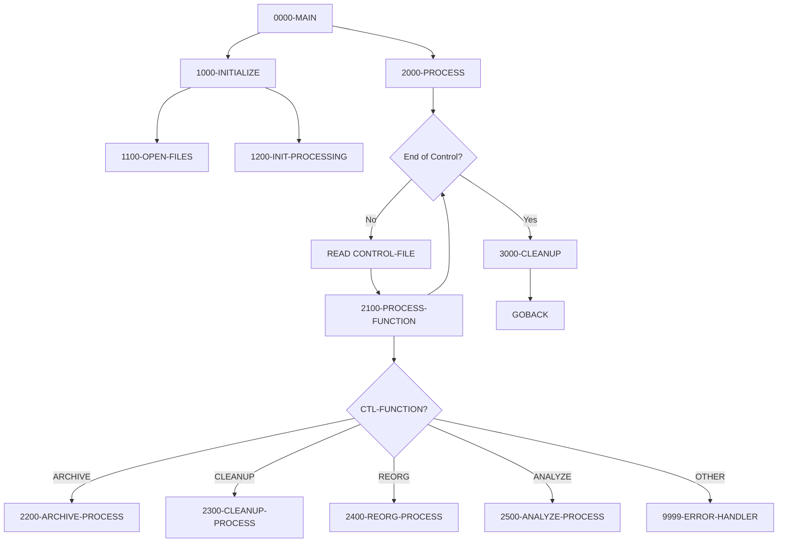
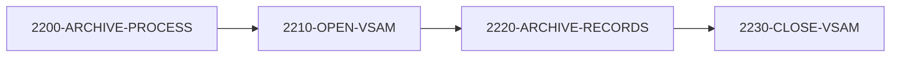
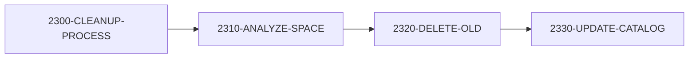
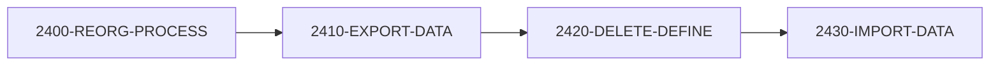

## Overview

UTLMNT00 is a file maintenance utility that performs various housekeeping operations on VSAM files within the system. It reads maintenance requests from a control file and executes the appropriate function for each request.

The program supports four primary maintenance functions: archiving records to a sequential file, cleaning up old data and managing space, reorganizing VSAM clusters, and analyzing file statistics for reporting. Each function is driven by control records that specify the target file and operational parameters.

This utility is essential for system administration, enabling automated maintenance of VSAM files to ensure optimal performance, manage storage utilization, and maintain data retention policies.

## Program Structure



## Function Processing Flows

### Archive Process



### Cleanup Process



### Reorganization Process



### Analysis Process


## Data Structures

### Control Record

The control file contains maintenance requests with the following structure:

| Level | Name | Picture | Description |
|-------|------|---------|-------------|
| 01 | CONTROL-RECORD | - | Maintenance request record |
| 05 | CTL-FUNCTION | X(8) | Function to perform |
| 05 | CTL-FILE-NAME | X(44) | Target VSAM file name |
| 05 | CTL-PARAMETERS | X(100) | Function-specific parameters |

### Function Codes

| Function | Constant | Description |
|----------|----------|-------------|
| `ARCHIVE` | WS-ARCHIVE | Archive records from VSAM to sequential file |
| `CLEANUP` | WS-CLEANUP | Remove old records and manage space |
| `REORG` | WS-REORG | Reorganize VSAM cluster |
| `ANALYZE` | WS-ANALYZE | Collect statistics and generate report |

### Archive Record

| Level | Name | Picture | Description |
|-------|------|---------|-------------|
| 01 | ARCHIVE-RECORD | X(32760) | Variable-length archive output |

### Report Record

| Level | Name | Picture | Description |
|-------|------|---------|-------------|
| 01 | REPORT-RECORD | X(132) | Fixed-length report line |

### Working Storage

#### File Status

| Level | Name | Picture | Description |
|-------|------|---------|-------------|
| 05 | WS-CTL-STATUS | XX | Control file status |
| 05 | WS-ARCH-STATUS | XX | Archive file status |
| 05 | WS-REPORT-STATUS | XX | Report file status |

#### Processing Flags

| Level | Name | Picture | Description |
|-------|------|---------|-------------|
| 05 | WS-END-OF-CTL | X | End of control file indicator |
| 05 | WS-FUNCTION-FLAG | X | Valid function indicator |

#### Counters

| Level | Name | Picture | Description |
|-------|------|---------|-------------|
| 05 | WS-RECORDS-READ | 9(9) | Records read counter |
| 05 | WS-RECORDS-WRITTEN | 9(9) | Records written counter |
| 05 | WS-ERROR-COUNT | 9(9) | Error counter |

#### VSAM Control

| Level | Name | Picture | Description |
|-------|------|---------|-------------|
| 05 | WS-VSAM-NAME | X(44) | Current VSAM file name |
| 05 | WS-VSAM-FUNCTION | X(8) | Current function |
| 05 | WS-VSAM-STATUS | XX | VSAM operation status |

## File I/O

### CONTROL-FILE

The sequential input file containing maintenance requests.

| Property | Value |
|----------|-------|
| Logical Name | CONTROL-FILE |
| DD Name | CTLFILE |
| Organization | SEQUENTIAL |
| Access Mode | SEQUENTIAL |
| Open Mode | INPUT |
| Recording Mode | F (Fixed) |
| File Status | WS-CTL-STATUS |

### ARCHIVE-FILE

The sequential output file for archived records.

| Property | Value |
|----------|-------|
| Logical Name | ARCHIVE-FILE |
| DD Name | ARCHFILE |
| Organization | SEQUENTIAL |
| Access Mode | SEQUENTIAL |
| Open Mode | OUTPUT |
| Recording Mode | V (Variable) |
| Max Record Length | 32760 bytes |
| File Status | WS-ARCH-STATUS |

### REPORT-FILE

The sequential output file for analysis reports.

| Property | Value |
|----------|-------|
| Logical Name | REPORT-FILE |
| DD Name | RPTFILE |
| Organization | SEQUENTIAL |
| Access Mode | SEQUENTIAL |
| Open Mode | OUTPUT |
| Recording Mode | F (Fixed) |
| Record Length | 132 bytes |
| File Status | WS-REPORT-STATUS |

## Control Flow

### Main Processing (0000-MAIN)

Controls the overall program flow:
1. Calls 1000-INITIALIZE for setup
2. Calls 2000-PROCESS to execute maintenance requests
3. Calls 3000-CLEANUP for termination
4. Returns via GOBACK

### Initialize (1000-INITIALIZE)

Prepares the processing environment:
1. **1100-OPEN-FILES**: Opens control, archive, and report files
2. **1200-INIT-PROCESSING**: Initializes counters to zero

### Process (2000-PROCESS)

Main processing loop:
1. Reads control file records until end-of-file
2. For each record, calls 2100-PROCESS-FUNCTION
3. Uses PERFORM UNTIL with END-OF-CONTROL condition

### Process Function (2100-PROCESS-FUNCTION)

Routes to the appropriate function handler using EVALUATE:

| CTL-FUNCTION | Handler | Description |
|--------------|---------|-------------|
| ARCHIVE | 2200-ARCHIVE-PROCESS | Archive records |
| CLEANUP | 2300-CLEANUP-PROCESS | Clean up files |
| REORG | 2400-REORG-PROCESS | Reorganize VSAM |
| ANALYZE | 2500-ANALYZE-PROCESS | Analyze files |
| Other | 9999-ERROR-HANDLER | Invalid function |

### Archive Process (2200-ARCHIVE-PROCESS)

Archives records from a VSAM file:
1. **2210-OPEN-VSAM**: Opens the target VSAM file
2. **2220-ARCHIVE-RECORDS**: Copies records to archive file
3. **2230-CLOSE-VSAM**: Closes the VSAM file

### Cleanup Process (2300-CLEANUP-PROCESS)

Performs file cleanup operations:
1. **2310-ANALYZE-SPACE**: Analyzes current space usage
2. **2320-DELETE-OLD**: Deletes records meeting retention criteria
3. **2330-UPDATE-CATALOG**: Updates catalog information

### Reorganization Process (2400-REORG-PROCESS)

Reorganizes a VSAM cluster:
1. **2410-EXPORT-DATA**: Exports data to temporary storage
2. **2420-DELETE-DEFINE**: Deletes and redefines the cluster
3. **2430-IMPORT-DATA**: Imports data back into the cluster

### Analysis Process (2500-ANALYZE-PROCESS)

Generates file statistics:
1. **2510-COLLECT-STATS**: Collects file statistics
2. **2520-GENERATE-REPORT**: Produces analysis report

### Cleanup (3000-CLEANUP)

Closes all files:
- CONTROL-FILE
- ARCHIVE-FILE
- REPORT-FILE

### Error Handler (9999-ERROR-HANDLER)

Handles errors during processing:
1. Increments WS-ERROR-COUNT
2. Displays error message to console via DISPLAY UPON CONS
3. If error count exceeds 100:
   - Sets RETURN-CODE to 12
   - Terminates via GOBACK

## Maintenance Functions

### ARCHIVE Function

**Purpose:** Copies records from a VSAM file to a sequential archive file for long-term storage or backup.

**Input Parameters:**
- CTL-FILE-NAME: Source VSAM file name
- CTL-PARAMETERS: Archive criteria (dates, record types, etc.)

**Output:**
- Records written to ARCHIVE-FILE

### CLEANUP Function

**Purpose:** Removes old or obsolete records from a VSAM file based on retention policies and manages space utilization.

**Input Parameters:**
- CTL-FILE-NAME: Target VSAM file name
- CTL-PARAMETERS: Retention criteria, cutoff dates

**Actions:**
- Analyzes current space usage
- Deletes qualifying records
- Updates catalog information

### REORG Function

**Purpose:** Reorganizes a VSAM cluster to reclaim space, improve performance, and eliminate CI/CA splits.

**Input Parameters:**
- CTL-FILE-NAME: Target VSAM file name
- CTL-PARAMETERS: Reorganization options

**Actions:**
- Exports all data to temporary storage
- Deletes and redefines the VSAM cluster
- Imports data back with optimal organization

### ANALYZE Function

**Purpose:** Collects and reports statistics about VSAM file usage, space allocation, and performance characteristics.

**Input Parameters:**
- CTL-FILE-NAME: Target VSAM file name
- CTL-PARAMETERS: Analysis options

**Output:**
- Statistics report written to REPORT-FILE

## Processing Controls

| Control | Threshold | Action |
|---------|-----------|--------|
| Error Count | > 100 | Terminate with RC=12 |
| End of Control | Reached | Normal termination |

## Return Codes

| Code | Description |
|------|-------------|
| 0 | Processing completed successfully |
| 12 | Terminated due to excessive errors (>100) |

## Dependencies

### Copybooks

- **RTNCODE** - Return code management structure
- **ERRHAND** - Error handling definitions

### Related Programs

Programs that share the RTNCODE copybook:
- RPTAUD00 - Audit reporting
- RPTPOS00 - Position reporting
- RPTSTA00 - Status reporting
- RTNCDE00 - Return code handler
- TSTGEN00 - Test generation
- TSTVAL00 - Test validation
- UTLMON00 - Utility monitoring
- UTLVAL00 - Utility validation

## JCL Example

```jcl
//UTLMNT00 EXEC PGM=UTLMNT00
//STEPLIB  DD  DSN=your.loadlib,DISP=SHR
//CTLFILE  DD  DSN=your.control.file,DISP=SHR
//ARCHFILE DD  DSN=your.archive.file,
//             DISP=(NEW,CATLG,DELETE),
//             SPACE=(CYL,(10,5)),
//             DCB=(RECFM=VB,LRECL=32764,BLKSIZE=0)
//RPTFILE  DD  SYSOUT=*
//SYSOUT   DD  SYSOUT=*
```

## Control File Format

Each record in the control file specifies one maintenance operation:

```
Column   Length  Content
1-8      8       Function code (ARCHIVE, CLEANUP, REORG, ANALYZE)
9-52     44      VSAM file name (fully qualified)
53-152   100     Function-specific parameters
```

## Sample Control File

```
ARCHIVE YOUR.VSAM.TRANS.FILE                        DATE=2024-01-01,TYPE=HIST
CLEANUP YOUR.VSAM.AUDIT.FILE                        RETAIN=90,DELETE=ARCHIVE
REORG   YOUR.VSAM.MASTER.FILE                       FREESPACE=20
ANALYZE YOUR.VSAM.POSITION.FILE                     DETAIL=YES,FORMAT=FULL
```

## Technical Notes

- The program uses **SPECIAL-NAMES** to define `CONSOLE IS CONS` for operator communication
- **DISPLAY ... UPON CONS** writes error messages to the operator console
- **RECORDING MODE IS V** on ARCHIVE-FILE enables variable-length records up to 32,760 bytes
- **BLOCK CONTAINS 0 RECORDS** allows the system to determine optimal blocking
- The program uses a control-file-driven architecture, allowing flexible batch scheduling of maintenance tasks
- Sub-paragraphs (2210, 2220, etc.) are structured as placeholder implementations to be customized for specific VSAM access methods
- File names support up to 44 characters to accommodate fully qualified MVS dataset names
- The 132-byte report record is standard for mainframe print files
