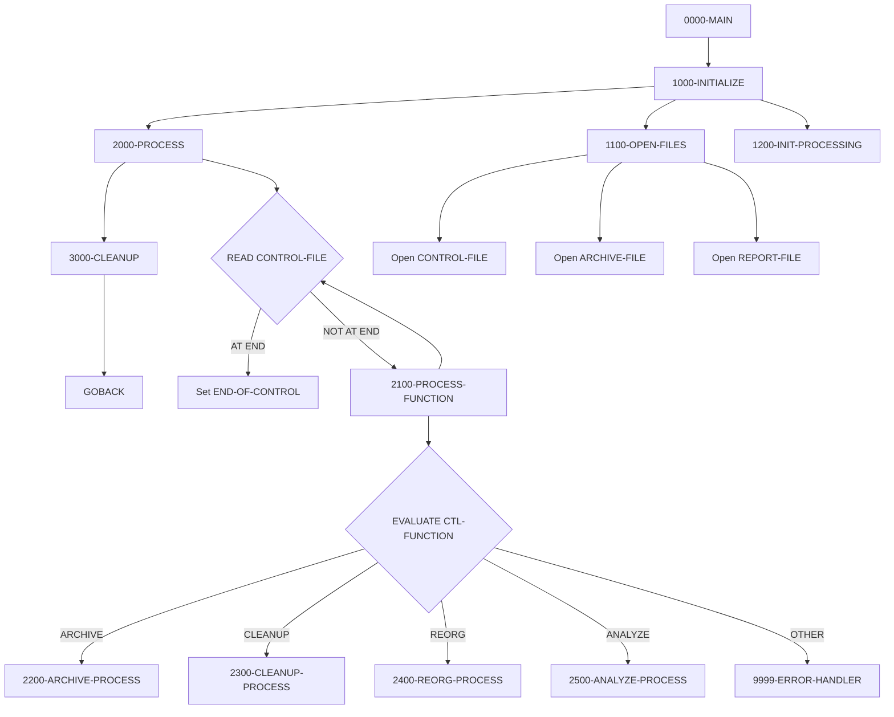
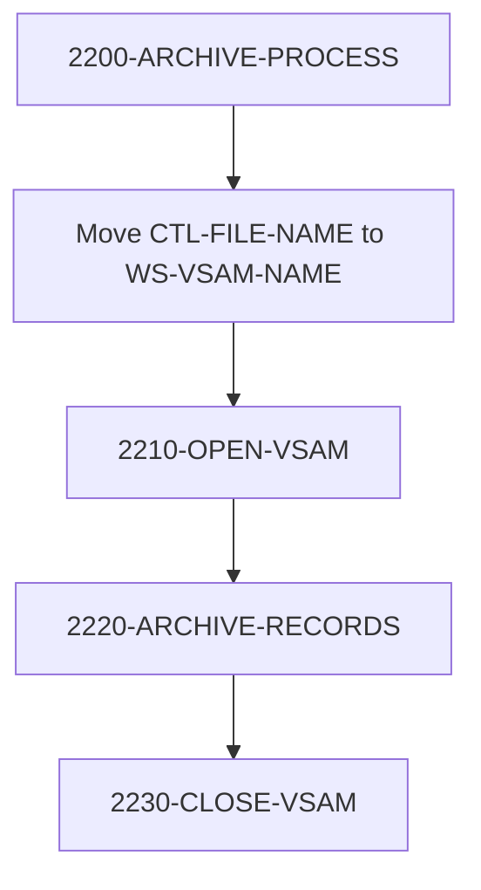
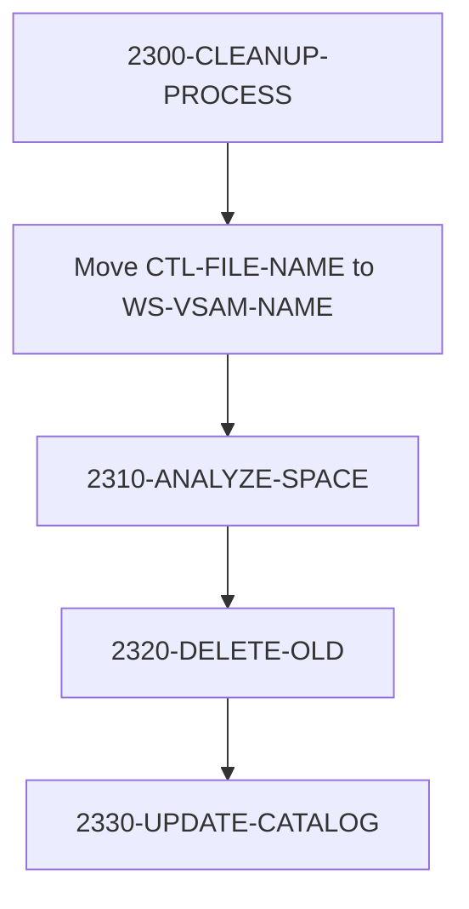
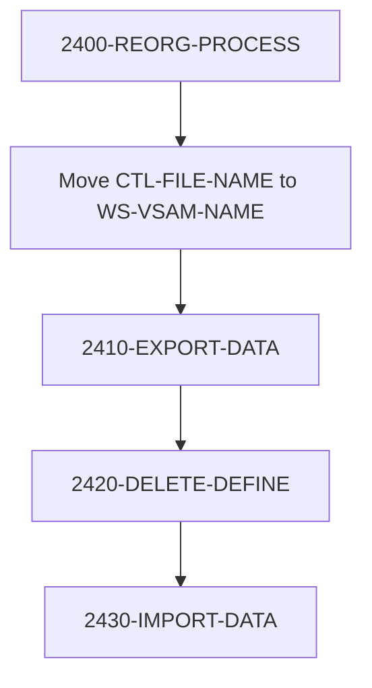
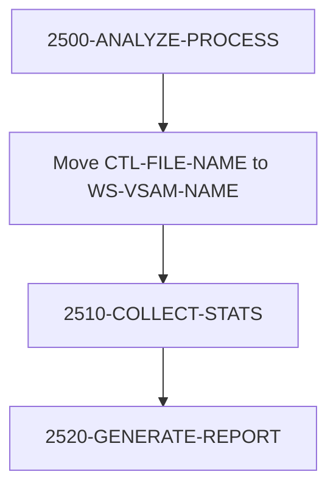

## Overview

UTLMNT00 is a File Maintenance Utility program that performs various maintenance operations on system files, particularly VSAM datasets. It provides a control-file driven interface for executing four types of maintenance functions: archiving, cleanup, reorganization, and analysis.

The program reads control records from an input file, where each record specifies a function to perform and the target file to operate on. This design allows batch scheduling of multiple maintenance operations in a single job step, with flexible control over which files are processed and how.

UTLMNT00 is designed for operational support, automating routine maintenance tasks that would otherwise require manual intervention or multiple utility jobs. It includes an error threshold that terminates processing after 100 errors to prevent runaway conditions.

## Program Structure



## Data Structures

### Control Record (File Section)

| Level | Name | Picture | Description |
|-------|------|---------|-------------|
| 01 | CONTROL-RECORD | | Maintenance control record |
| 05 | CTL-FUNCTION | X(8) | Function to perform |
| 05 | CTL-FILE-NAME | X(44) | Target file dataset name |
| 05 | CTL-PARAMETERS | X(100) | Additional parameters for the function |

### Supported Functions

| Function | Constant | Description |
|----------|----------|-------------|
| `ARCHIVE` | WS-ARCHIVE | Archive records from a file |
| `CLEANUP` | WS-CLEANUP | Clean up old records and reclaim space |
| `REORG` | WS-REORG | Reorganize VSAM file structure |
| `ANALYZE` | WS-ANALYZE | Analyze file and generate statistics report |

### Working Storage - File Status

| Level | Name | Picture | Description |
|-------|------|---------|-------------|
| 05 | WS-CTL-STATUS | XX | Control file status |
| 05 | WS-ARCH-STATUS | XX | Archive file status |
| 05 | WS-REPORT-STATUS | XX | Report file status |

### Working Storage - Processing Flags

| Level | Name | Picture | Value | Description |
|-------|------|---------|-------|-------------|
| 05 | WS-END-OF-CTL | X | 'N' | End of control file flag |
| 05 | WS-FUNCTION-FLAG | X | 'N' | Valid function indicator |

### Working Storage - Counters

| Level | Name | Picture | Description |
|-------|------|---------|-------------|
| 05 | WS-RECORDS-READ | 9(9) | Total records read |
| 05 | WS-RECORDS-WRITTEN | 9(9) | Total records written |
| 05 | WS-ERROR-COUNT | 9(9) | Error counter |

### Working Storage - VSAM Control

| Level | Name | Picture | Description |
|-------|------|---------|-------------|
| 05 | WS-VSAM-NAME | X(44) | VSAM dataset name |
| 05 | WS-VSAM-FUNCTION | X(8) | Current VSAM operation |
| 05 | WS-VSAM-STATUS | XX | VSAM operation status |

## File I/O

### CONTROL-FILE

| Attribute | Value |
|-----------|-------|
| DD Name | CTLFILE |
| Organization | Sequential |
| Recording Mode | Fixed (F) |
| Open Mode | INPUT |
| Record Length | 152 bytes |

Operations:
- **READ** - Read control records specifying maintenance functions

### ARCHIVE-FILE

| Attribute | Value |
|-----------|-------|
| DD Name | ARCHFILE |
| Organization | Sequential |
| Recording Mode | Variable (V) |
| Open Mode | OUTPUT |
| Max Record Length | 32,760 bytes |

Operations:
- **WRITE** - Write archived records

### REPORT-FILE

| Attribute | Value |
|-----------|-------|
| DD Name | RPTFILE |
| Organization | Sequential |
| Recording Mode | Fixed (F) |
| Open Mode | OUTPUT |
| Record Length | 132 bytes |

Operations:
- **WRITE** - Write analysis and status reports

## Control Flow

### 0000-MAIN

Main driver that orchestrates the three processing phases:
1. 1000-INITIALIZE - Opens files and initializes counters
2. 2000-PROCESS - Reads and processes control records
3. 3000-CLEANUP - Closes all files

### 1000-INITIALIZE

1. Calls 1100-OPEN-FILES to open all three files
2. Calls 1200-INIT-PROCESSING to initialize counters

### 1100-OPEN-FILES

Opens the three files in sequence:
1. CONTROL-FILE for INPUT
2. ARCHIVE-FILE for OUTPUT
3. REPORT-FILE for OUTPUT

Any file open error triggers 9999-ERROR-HANDLER with appropriate message.

### 1200-INIT-PROCESSING

Initializes WS-COUNTERS to zero values.

### 2000-PROCESS

Main processing loop:
```cobol
PERFORM UNTIL END-OF-CONTROL
    READ CONTROL-FILE
        AT END
            SET END-OF-CONTROL TO TRUE
        NOT AT END
            PERFORM 2100-PROCESS-FUNCTION
    END-READ
END-PERFORM
```

### 2100-PROCESS-FUNCTION

Routes to appropriate processing paragraph based on CTL-FUNCTION:

| Function Value | Paragraph Called |
|----------------|------------------|
| `ARCHIVE` | 2200-ARCHIVE-PROCESS |
| `CLEANUP` | 2300-CLEANUP-PROCESS |
| `REORG` | 2400-REORG-PROCESS |
| `ANALYZE` | 2500-ANALYZE-PROCESS |
| Other | 9999-ERROR-HANDLER |

### 3000-CLEANUP

Closes all three files: CONTROL-FILE, ARCHIVE-FILE, REPORT-FILE.

### 9999-ERROR-HANDLER

1. Increments WS-ERROR-COUNT
2. Displays error message to console (CONS)
3. If error count exceeds 100:
   - Sets RETURN-CODE to 12
   - Immediately GOBACKs to terminate

## Maintenance Functions

### ARCHIVE Process (2200-ARCHIVE-PROCESS)

Archives records from the specified VSAM file to the ARCHIVE-FILE.



**Sub-paragraphs:**
- **2210-OPEN-VSAM** - Opens the target VSAM file for input
- **2220-ARCHIVE-RECORDS** - Reads and writes records to archive
- **2230-CLOSE-VSAM** - Closes the VSAM file

### CLEANUP Process (2300-CLEANUP-PROCESS)

Performs cleanup operations including space analysis and deletion of old records.



**Sub-paragraphs:**
- **2310-ANALYZE-SPACE** - Analyzes space utilization
- **2320-DELETE-OLD** - Deletes records meeting cleanup criteria
- **2330-UPDATE-CATALOG** - Updates catalog entries

### REORG Process (2400-REORG-PROCESS)

Reorganizes a VSAM file through export, delete/define, and import.



**Sub-paragraphs:**
- **2410-EXPORT-DATA** - Exports VSAM data to sequential file
- **2420-DELETE-DEFINE** - Deletes and redefines VSAM cluster
- **2430-IMPORT-DATA** - Imports data back into new cluster

### ANALYZE Process (2500-ANALYZE-PROCESS)

Collects statistics and generates analysis reports.



**Sub-paragraphs:**
- **2510-COLLECT-STATS** - Collects file statistics
- **2520-GENERATE-REPORT** - Writes analysis report to REPORT-FILE

## Dependencies

### Copybooks

- **RTNCODE** - Return code management definitions for standardized return code handling
- **ERRHAND** - Standard error handling definitions including error message structure

### Related Programs

Programs that share copybooks with UTLMNT00:

| Program | Shared Copybooks | Description |
|---------|-----------------|-------------|
| UTLMON00 | RTNCODE, ERRHAND | Utility monitoring |
| UTLVAL00 | RTNCODE, ERRHAND | Utility validation |
| RTNCDE00 | RTNCODE | Return code handler |
| RPTAUD00 | RTNCODE, ERRHAND | Audit reporting |
| RPTPOS00 | RTNCODE, ERRHAND | Position reporting |
| RPTSTA00 | RTNCODE, ERRHAND | Status reporting |
| TSTGEN00 | RTNCODE, ERRHAND | Test data generation |
| TSTVAL00 | RTNCODE, ERRHAND | Test validation |

## JCL Example

```jcl
//UTLMNT00 EXEC PGM=UTLMNT00
//STEPLIB  DD   DSN=your.loadlib,DISP=SHR
//CTLFILE  DD   DSN=your.control.file,DISP=SHR
//ARCHFILE DD   DSN=your.archive.file,
//             DISP=(NEW,CATLG,DELETE),
//             SPACE=(CYL,(10,5),RLSE),
//             DCB=(RECFM=VB,LRECL=32764,BLKSIZE=0)
//RPTFILE  DD   SYSOUT=*,DCB=(RECFM=FB,LRECL=132)
//SYSOUT   DD   SYSOUT=*
```

## Control File Format

Each control record specifies one maintenance operation:

```
Column   1-8:   Function (ARCHIVE, CLEANUP, REORG, ANALYZE)
Column   9-52:  Dataset name (44 characters)
Column  53-152: Parameters (function-specific)
```

### Example Control File

```
ARCHIVE YOUR.VSAM.FILE1                             DAYS=30
CLEANUP YOUR.VSAM.FILE2                             THRESHOLD=80
REORG   YOUR.VSAM.FILE3                             CISIZE=4096
ANALYZE YOUR.VSAM.FILE4                             DETAIL=Y
```

## Return Codes

| Code | Description |
|------|-------------|
| 0 | Successful completion |
| 12 | Error threshold exceeded (>100 errors) |

## Technical Notes

1. **SPECIAL-NAMES**: The program uses `CONSOLE IS CONS` to allow DISPLAY statements to write directly to the operator console for error messages.

2. **Variable Length Archive**: ARCHIVE-FILE uses RECORDING MODE V with 32,760 byte maximum record length to accommodate various record sizes from different source files.

3. **Error Threshold**: Processing terminates immediately when error count exceeds 100, preventing runaway error conditions during batch execution.

4. **Dataset Name Length**: CTL-FILE-NAME is 44 characters, the maximum length for z/OS dataset names.

5. **Control-Driven Design**: The program processes multiple files in a single execution by reading control records, reducing JCL complexity and job scheduling overhead.

6. **Stub Paragraphs**: The detailed sub-paragraphs (2210, 2220, 2310, 2320, etc.) are defined in the program structure but contain implementation stubs. They represent the intended design for future enhancement.

7. **BLOCK CONTAINS 0**: All files use `BLOCK CONTAINS 0 RECORDS`, allowing the system to determine optimal blocking based on device characteristics.
