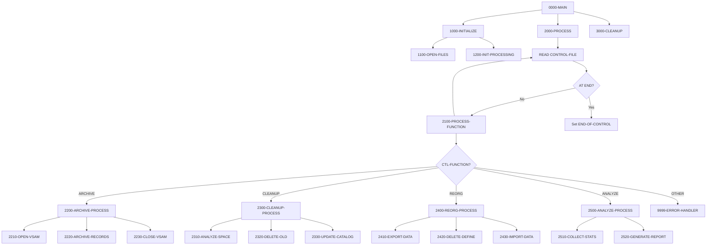
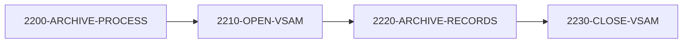
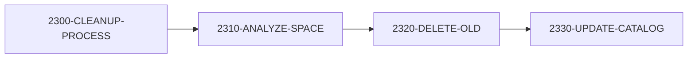
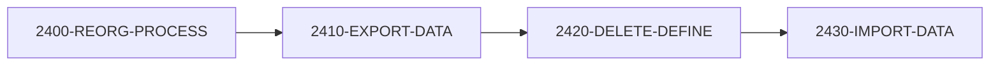
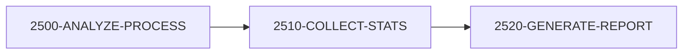

## Overview

UTLMNT00 is a general-purpose file maintenance utility that performs critical housekeeping operations on system files. The program reads control cards from an input file and executes the requested maintenance function on the specified target file. It supports four maintenance operations: archive processing, file cleanup, VSAM reorganization, and space analysis.

The utility is designed for batch execution as part of regular system maintenance jobs. It processes multiple control cards in sequence, allowing a single job step to perform maintenance on multiple files. The program includes error threshold protection, terminating with return code 12 if more than 100 errors occur.

This program integrates with the standard error handling (ERRHAND) and return code management (RTNCODE) frameworks used throughout the system.

## Program Structure



## Data Structures

### Control Record (File Section)

The control file specifies maintenance operations to perform:

| Level | Name | Picture | Description |
|-------|------|---------|-------------|
| 01 | CONTROL-RECORD | - | Control card record |
| 05 | CTL-FUNCTION | X(8) | Function: ARCHIVE, CLEANUP, REORG, ANALYZE |
| 05 | CTL-FILE-NAME | X(44) | Target dataset name |
| 05 | CTL-PARAMETERS | X(100) | Function-specific parameters |

### Archive Record (File Section)

| Level | Name | Picture | Description |
|-------|------|---------|-------------|
| 01 | ARCHIVE-RECORD | X(32760) | Variable-length archive record |

### Report Record (File Section)

| Level | Name | Picture | Description |
|-------|------|---------|-------------|
| 01 | REPORT-RECORD | X(132) | Fixed-length report line |

### Working Storage

#### File Status Fields

| Level | Name | Picture | Description |
|-------|------|---------|-------------|
| 05 | WS-CTL-STATUS | XX | Control file status |
| 05 | WS-ARCH-STATUS | XX | Archive file status |
| 05 | WS-REPORT-STATUS | XX | Report file status |

#### Processing Flags

| Level | Name | Picture | Value | Description |
|-------|------|---------|-------|-------------|
| 05 | WS-END-OF-CTL | X | 'N' | End-of-control flag |
| 05 | WS-FUNCTION-FLAG | X | 'N' | Valid function indicator |

#### Function Constants

| Level | Name | Picture | Value | Description |
|-------|------|---------|-------|-------------|
| 05 | WS-ARCHIVE | X(8) | 'ARCHIVE' | Archive function code |
| 05 | WS-CLEANUP | X(8) | 'CLEANUP' | Cleanup function code |
| 05 | WS-REORG | X(8) | 'REORG' | Reorganization function code |
| 05 | WS-ANALYZE | X(8) | 'ANALYZE' | Analysis function code |

#### Counters

| Level | Name | Picture | Description |
|-------|------|---------|-------------|
| 05 | WS-RECORDS-READ | 9(9) | Records read counter |
| 05 | WS-RECORDS-WRITTEN | 9(9) | Records written counter |
| 05 | WS-ERROR-COUNT | 9(9) | Error counter |

#### VSAM Control

| Level | Name | Picture | Description |
|-------|------|---------|-------------|
| 05 | WS-VSAM-NAME | X(44) | Target VSAM dataset name |
| 05 | WS-VSAM-FUNCTION | X(8) | Current VSAM operation |
| 05 | WS-VSAM-STATUS | XX | VSAM operation status |

## File I/O

### CONTROL-FILE

| Attribute | Value |
|-----------|-------|
| Logical Name | CONTROL-FILE |
| DD Name | CTLFILE |
| Organization | SEQUENTIAL |
| Recording Mode | F (Fixed) |
| Open Mode | INPUT |
| File Status | WS-CTL-STATUS |

### ARCHIVE-FILE

| Attribute | Value |
|-----------|-------|
| Logical Name | ARCHIVE-FILE |
| DD Name | ARCHFILE |
| Organization | SEQUENTIAL |
| Recording Mode | V (Variable) |
| Open Mode | OUTPUT |
| File Status | WS-ARCH-STATUS |

### REPORT-FILE

| Attribute | Value |
|-----------|-------|
| Logical Name | REPORT-FILE |
| DD Name | RPTFILE |
| Organization | SEQUENTIAL |
| Recording Mode | F (Fixed) |
| Open Mode | OUTPUT |
| File Status | WS-REPORT-STATUS |

## Control Flow

### 1000-INITIALIZE

Prepares the program for processing:
1. Calls 1100-OPEN-FILES to open all required files
2. Calls 1200-INIT-PROCESSING to initialize counters

### 1100-OPEN-FILES

Opens all program files with error checking:
1. Opens CONTROL-FILE for INPUT
2. Opens ARCHIVE-FILE for OUTPUT
3. Opens REPORT-FILE for OUTPUT
4. Calls 9999-ERROR-HANDLER if any file fails to open

### 2000-PROCESS

Main processing loop:
```cobol
PERFORM UNTIL END-OF-CONTROL
    READ CONTROL-FILE
        AT END
            SET END-OF-CONTROL TO TRUE
        NOT AT END
            PERFORM 2100-PROCESS-FUNCTION
    END-READ
END-PERFORM
```

### 2100-PROCESS-FUNCTION

Dispatches to appropriate function handler based on CTL-FUNCTION:

| Function | Handler | Description |
|----------|---------|-------------|
| ARCHIVE | 2200-ARCHIVE-PROCESS | Archive old records |
| CLEANUP | 2300-CLEANUP-PROCESS | Clean up file space |
| REORG | 2400-REORG-PROCESS | Reorganize VSAM file |
| ANALYZE | 2500-ANALYZE-PROCESS | Analyze file statistics |
| Other | 9999-ERROR-HANDLER | Invalid function |

## Maintenance Functions

### Archive Process (2200-ARCHIVE-PROCESS)

Copies records from a VSAM file to the sequential archive file:



1. **2210-OPEN-VSAM**: Opens the target VSAM file specified in CTL-FILE-NAME
2. **2220-ARCHIVE-RECORDS**: Reads and writes records to ARCHIVE-FILE
3. **2230-CLOSE-VSAM**: Closes the VSAM file

### Cleanup Process (2300-CLEANUP-PROCESS)

Removes old data and reclaims space:



1. **2310-ANALYZE-SPACE**: Analyzes current space utilization
2. **2320-DELETE-OLD**: Deletes records matching cleanup criteria
3. **2330-UPDATE-CATALOG**: Updates catalog entries

### Reorganization Process (2400-REORG-PROCESS)

Performs VSAM reorganization (export/delete/reimport):



1. **2410-EXPORT-DATA**: Exports all records to a sequential file
2. **2420-DELETE-DEFINE**: Deletes and redefines the VSAM cluster
3. **2430-IMPORT-DATA**: Imports records back into the reorganized file

### Analysis Process (2500-ANALYZE-PROCESS)

Collects and reports file statistics:



1. **2510-COLLECT-STATS**: Gathers file statistics (record counts, space usage)
2. **2520-GENERATE-REPORT**: Writes statistics to REPORT-FILE

## Error Handling

### 9999-ERROR-HANDLER

Centralized error processing:
1. Increments WS-ERROR-COUNT
2. Displays error message to console (CONS)
3. If error count exceeds 100:
   - Sets RETURN-CODE to 12
   - Immediately terminates via GOBACK

```cobol
9999-ERROR-HANDLER.
    ADD 1 TO WS-ERROR-COUNT
    DISPLAY WS-ERROR-MESSAGE UPON CONS
    IF WS-ERROR-COUNT > 100
        MOVE 12 TO RETURN-CODE
        GOBACK
    END-IF.
```

## Return Codes

| Code | Meaning |
|------|---------|
| 0 | Successful completion |
| 12 | Terminated due to excessive errors (> 100) |

## Control Card Format

```
ARCHIVE  dataset.name.here                                  parm1,parm2
CLEANUP  dataset.name.here                                  retention=30
REORG    dataset.name.here                                  
ANALYZE  dataset.name.here                                  detail=Y
```

| Column | Length | Content |
|--------|--------|---------|
| 1-8 | 8 | Function code |
| 9-52 | 44 | Dataset name |
| 53-152 | 100 | Parameters |

## Dependencies

### Copybooks

- **RTNCODE** - Return code management structures
- **ERRHAND** - Standard error handling definitions

### Related Programs

Programs that share the RTNCODE copybook:
- **RTNCDE00** - Return code handler
- **RPTAUD00** - Audit reporting
- **RPTPOS00** - Position reporting
- **RPTSTA00** - Status reporting
- **TSTGEN00** - Test generation
- **TSTVAL00** - Test validation
- **UTLMON00** - Monitoring utility
- **UTLVAL00** - Validation utility

## Technical Notes

1. **SPECIAL-NAMES CONSOLE**: The `CONSOLE IS CONS` clause defines CONS as the console device name, allowing `DISPLAY ... UPON CONS` to write directly to the operator console.

2. **RECORDING MODE V**: The archive file uses variable-length records (up to 32,760 bytes) to accommodate different record sizes from various source files.

3. **RECORDING MODE F**: Control and report files use fixed-length records for consistent processing.

4. **BLOCK CONTAINS 0**: Allows the system to determine optimal block size based on device characteristics.

5. **Error Threshold**: The 100-error limit prevents runaway processing when systematic problems occur (e.g., missing VSAM file, permission issues).

6. **Dataset Names**: The 44-character CTL-FILE-NAME field accommodates standard z/OS dataset names (up to 44 characters).

7. **Stub Paragraphs**: Several implementation paragraphs (2210, 2220, etc.) are defined but contain minimal implementation, indicating this is a framework program requiring customization.

8. **GOBACK vs STOP RUN**: The program uses GOBACK to return control to the calling program or JCL, preserving the RETURN-CODE value.

## JCL Example

```jcl
//UTLMNT00 EXEC PGM=UTLMNT00
//STEPLIB  DD DSN=your.loadlib,DISP=SHR
//CTLFILE  DD DSN=your.control.cards,DISP=SHR
//ARCHFILE DD DSN=your.archive.output,
//            DISP=(NEW,CATLG,DELETE),
//            SPACE=(CYL,(10,5)),
//            DCB=(RECFM=VB,LRECL=32764,BLKSIZE=0)
//RPTFILE  DD SYSOUT=*
//SYSOUT   DD SYSOUT=*
```

## Sample Control Cards

```
ARCHIVE PROD.PORTFOLIO.MASTER                              DATE=20231231
CLEANUP PROD.TRANSACTION.HISTORY                           DAYS=90
REORG   PROD.POSITION.MASTER
ANALYZE PROD.PORTFOLIO.MASTER                              DETAIL=Y
```
