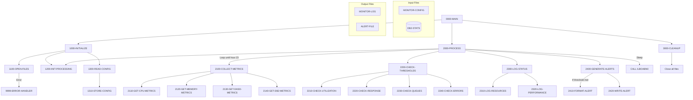

## Overview

UTLMON00 is a system monitoring utility program that provides comprehensive health and performance monitoring for the portfolio management system. The program continuously monitors system resources, collects performance metrics, checks against configurable thresholds, and generates alerts when conditions warrant attention.

This utility is designed to run as a long-running batch job that monitors the system throughout the operational day (until hour 23). Key features include:

- **Resource Utilization Tracking**: Monitors CPU, memory, DASD, and DB2 utilization levels
- **Performance Metrics Collection**: Gathers response times, queue depths, and error counts
- **Configurable Thresholds**: Reads threshold definitions from a configuration file
- **Alert Generation**: Creates alerts at INFO, WARNING, and CRITICAL levels when thresholds are exceeded
- **Continuous Logging**: Writes periodic status logs for trend analysis and capacity planning

## Program Structure



## Data Structures

### File Section

#### CONFIG-RECORD (MONITOR-CONFIG)

| Level | Name | Picture | Description |
|-------|------|---------|-------------|
| 01 | CONFIG-RECORD | - | Threshold configuration record |
| 05 | CFG-RESOURCE-TYPE | X(10) | Resource type (CPU/MEMORY/DASD/DB2) |
| 05 | CFG-THRESHOLD-TYPE | X(10) | Threshold type (UTIL/RESPONSE/QUEUE/ERROR) |
| 05 | CFG-THRESHOLD-VALUE | 9(9)V99 | Threshold value |
| 05 | CFG-ALERT-LEVEL | X(10) | Alert level (INFO/WARNING/CRITICAL) |
| 05 | CFG-ALERT-ACTION | X(50) | Action to take when threshold exceeded |

#### LOG-RECORD (MONITOR-LOG)

| Level | Name | Picture | Description |
|-------|------|---------|-------------|
| 01 | LOG-RECORD | - | Monitoring log record |
| 05 | LOG-TIMESTAMP | X(26) | Timestamp of log entry |
| 05 | LOG-RESOURCE-TYPE | X(10) | Resource being logged |
| 05 | LOG-METRIC-NAME | X(20) | Name of the metric |
| 05 | LOG-METRIC-VALUE | 9(9)V99 | Current metric value |
| 05 | LOG-STATUS | X(10) | Status (NORMAL/WARNING/CRITICAL) |

#### ALERT-RECORD (ALERT-FILE)

| Level | Name | Picture | Description |
|-------|------|---------|-------------|
| 01 | ALERT-RECORD | - | Alert notification record |
| 05 | ALERT-TIMESTAMP | X(26) | Timestamp of alert |
| 05 | ALERT-LEVEL | X(10) | Alert severity level |
| 05 | ALERT-RESOURCE | X(10) | Resource causing alert |
| 05 | ALERT-MESSAGE | X(80) | Alert message text |

### Working Storage

#### WS-FILE-STATUS

| Level | Name | Picture | Description |
|-------|------|---------|-------------|
| 01 | WS-FILE-STATUS | - | File status codes group |
| 05 | WS-CFG-STATUS | XX | Config file status |
| 05 | WS-LOG-STATUS | XX | Log file status |
| 05 | WS-ALERT-STATUS | XX | Alert file status |
| 05 | WS-DB2-STATUS | XX | DB2 stats file status |

#### WS-RESOURCE-TYPES

| Level | Name | Picture | Value | Description |
|-------|------|---------|-------|-------------|
| 05 | WS-CPU | X(10) | 'CPU' | CPU resource identifier |
| 05 | WS-MEMORY | X(10) | 'MEMORY' | Memory resource identifier |
| 05 | WS-DASD | X(10) | 'DASD' | DASD resource identifier |
| 05 | WS-DB2 | X(10) | 'DB2' | DB2 resource identifier |

#### WS-THRESHOLD-TYPES

| Level | Name | Picture | Value | Description |
|-------|------|---------|-------|-------------|
| 05 | WS-UTILIZATION | X(10) | 'UTIL' | Utilization threshold |
| 05 | WS-RESPONSE | X(10) | 'RESPONSE' | Response time threshold |
| 05 | WS-QUEUE | X(10) | 'QUEUE' | Queue depth threshold |
| 05 | WS-ERROR | X(10) | 'ERROR' | Error count threshold |

#### WS-ALERT-LEVELS

| Level | Name | Picture | Value | Description |
|-------|------|---------|-------|-------------|
| 05 | WS-INFO | X(10) | 'INFO' | Informational alert |
| 05 | WS-WARNING | X(10) | 'WARNING' | Warning alert |
| 05 | WS-CRITICAL | X(10) | 'CRITICAL' | Critical alert |

#### WS-PROCESSING-FLAGS

| Level | Name | Picture | Description |
|-------|------|---------|-------------|
| 05 | WS-END-OF-CONFIG | X | End of config file flag |
| 05 | WS-THRESHOLD-MET | X | Threshold exceeded flag |

**Condition Names (88-levels):**

| Condition | Value | Description |
|-----------|-------|-------------|
| END-OF-CONFIG | 'Y' | All config records read |
| THRESHOLD-MET | 'Y' | A threshold was exceeded |

#### WS-CURRENT-METRICS

| Level | Name | Picture | Description |
|-------|------|---------|-------------|
| 01 | WS-CURRENT-METRICS | - | Current metric values |
| 05 | WS-CPU-UTIL | 9(3)V99 | CPU utilization percentage |
| 05 | WS-MEMORY-UTIL | 9(3)V99 | Memory utilization percentage |
| 05 | WS-DASD-UTIL | 9(3)V99 | DASD utilization percentage |
| 05 | WS-DB2-UTIL | 9(3)V99 | DB2 utilization percentage |
| 05 | WS-DB2-RESP | 9(5)V99 | DB2 response time (ms) |
| 05 | WS-DB2-QUEUE | 9(5) | DB2 queue depth |
| 05 | WS-DB2-ERRORS | 9(5) | DB2 error count |

#### WS-TIMESTAMP

| Level | Name | Picture | Description |
|-------|------|---------|-------------|
| 01 | WS-TIMESTAMP | - | Current timestamp |
| 05 | WS-DATE | - | Date portion |
| 10 | WS-YEAR | 9(4) | Year (YYYY) |
| 10 | WS-MONTH | 9(2) | Month (MM) |
| 10 | WS-DAY | 9(2) | Day (DD) |
| 05 | WS-TIME | - | Time portion |
| 10 | WS-HOUR | 9(2) | Hour (HH) |
| 10 | WS-MINUTE | 9(2) | Minute (MM) |
| 10 | WS-SECOND | 9(2) | Second (SS) |
| 10 | WS-HUNDREDTH | 9(2) | Hundredths of second |

## File I/O

### MONITOR-CONFIG

| Property | Value |
|----------|-------|
| Assign To | MONCFG |
| Organization | Sequential |
| Recording Mode | Fixed (F) |
| Access Mode | Sequential |
| File Status | WS-CFG-STATUS |
| Open Mode | INPUT |

Configuration file containing threshold definitions read at program initialization.

### MONITOR-LOG

| Property | Value |
|----------|-------|
| Assign To | MONLOG |
| Organization | Sequential |
| Recording Mode | Fixed (F) |
| Access Mode | Sequential |
| File Status | WS-LOG-STATUS |
| Open Mode | OUTPUT |

Output file for periodic status logs capturing resource metrics.

### ALERT-FILE

| Property | Value |
|----------|-------|
| Assign To | ALERTS |
| Organization | Sequential |
| Recording Mode | Fixed (F) |
| Access Mode | Sequential |
| File Status | WS-ALERT-STATUS |
| Open Mode | OUTPUT |

Output file for alert notifications when thresholds are exceeded.

### DB2-STATS

| Property | Value |
|----------|-------|
| Assign To | DB2STATS |
| Organization | Indexed (VSAM KSDS) |
| Access Mode | Dynamic |
| Record Key | STAT-KEY |
| File Status | WS-DB2-STATUS |
| Open Mode | INPUT |

Indexed file containing DB2 performance statistics.

### I/O Operations Summary

| Paragraph | File | Operation | Description |
|-----------|------|-----------|-------------|
| 1100-OPEN-FILES | MONITOR-CONFIG | OPEN INPUT | Open config for reading |
| 1100-OPEN-FILES | MONITOR-LOG | OPEN OUTPUT | Open log for writing |
| 1100-OPEN-FILES | ALERT-FILE | OPEN OUTPUT | Open alerts for writing |
| 1100-OPEN-FILES | DB2-STATS | OPEN INPUT | Open DB2 stats for reading |
| 1300-READ-CONFIG | MONITOR-CONFIG | READ | Read threshold configurations |
| 3000-CLEANUP | All files | CLOSE | Close all files |

## Control Flow

### 0000-MAIN

Entry point that orchestrates the monitoring cycle:
1. Performs initialization (open files, read config)
2. Loops through monitoring cycle until WS-HOUR = 23 (11 PM)
3. Performs cleanup (close files)
4. Returns to operating system via GOBACK

### 1000-INITIALIZE

Initialization sequence:
1. **1100-OPEN-FILES**: Opens all four files with error handling
2. **1200-INIT-PROCESSING**: Accepts current timestamp
3. **1300-READ-CONFIG**: Reads all threshold configurations

### 1100-OPEN-FILES

Opens each file and checks status:
- MONITOR-CONFIG (INPUT) - threshold definitions
- MONITOR-LOG (OUTPUT) - status logging
- ALERT-FILE (OUTPUT) - alert notifications
- DB2-STATS (INPUT) - DB2 performance data

If any file fails to open, sets error message and performs 9999-ERROR-HANDLER.

### 1300-READ-CONFIG

Reads configuration file in a loop:
1. Reads MONITOR-CONFIG until end of file
2. For each record, performs 1310-STORE-CONFIG to store threshold values
3. Sets END-OF-CONFIG when all records are read

### 2000-PROCESS

Main monitoring cycle executed repeatedly:
1. **2100-COLLECT-METRICS**: Gather current resource metrics
2. **2200-CHECK-THRESHOLDS**: Compare metrics against thresholds
3. **2300-LOG-STATUS**: Write status to log file
4. **2400-GENERATE-ALERTS**: Create alerts if thresholds exceeded
5. **CALL ILBOABN0**: Sleep for specified interval (WS-MINUTE)
6. **1200-INIT-PROCESSING**: Refresh timestamp for next cycle

### 2100-COLLECT-METRICS

Collects metrics from all monitored resources:
- **2110-GET-CPU-METRICS**: CPU utilization
- **2120-GET-MEMORY-METRICS**: Memory utilization
- **2130-GET-DASD-METRICS**: DASD utilization
- **2140-GET-DB2-METRICS**: DB2 utilization, response time, queue depth, errors

### 2200-CHECK-THRESHOLDS

Compares collected metrics against configured thresholds:
- **2210-CHECK-UTILIZATION**: Check resource utilization levels
- **2220-CHECK-RESPONSE**: Check response time thresholds
- **2230-CHECK-QUEUES**: Check queue depth thresholds
- **2240-CHECK-ERRORS**: Check error count thresholds

Sets THRESHOLD-MET flag if any threshold is exceeded.

### 2300-LOG-STATUS

Writes status information to the log file:
1. Moves current timestamp to LOG-TIMESTAMP
2. **2310-LOG-RESOURCES**: Logs resource utilization metrics
3. **2320-LOG-PERFORMANCE**: Logs performance metrics

### 2400-GENERATE-ALERTS

Generates alerts when thresholds are exceeded:
1. Checks THRESHOLD-MET flag
2. If true, performs 2410-FORMAT-ALERT to build alert record
3. Performs 2420-WRITE-ALERT to write to alert file

### 3000-CLEANUP

Closes all open files:
- MONITOR-CONFIG
- MONITOR-LOG
- ALERT-FILE
- DB2-STATS

### 9999-ERROR-HANDLER

Centralized error handling:
1. Displays WS-ERROR-MESSAGE to console (CONS)
2. Sets RETURN-CODE to 12
3. Terminates program via GOBACK

## Dependencies

### Copybooks

- DB2STAT - DB2 statistics file record layout
- [RTNCODE](/docs/copybooks/RTNCODE) - Return code management structure
- [ERRHAND](/docs/copybooks/ERRHAND) - Standard error handling definitions

### Called Programs

| Program | Purpose |
|---------|---------|
| ILBOABN0 | IBM Language Environment sleep routine (waits for specified interval) |

### Related Programs

Programs that share copybooks with UTLMON00:
- [RPTSTA00](/docs/programs/RPTSTA00) - Also uses DB2STAT copybook
- [RPTAUD00](/docs/programs/RPTAUD00), [RPTPOS00](/docs/programs/RPTPOS00) - Also use RTNCODE and ERRHAND copybooks
- [UTLMNT00](/docs/programs/UTLMNT00), [UTLVAL00](/docs/programs/UTLVAL00) - Related utility programs using same copybooks

## Return Codes

| Code | Description |
|------|-------------|
| 0 | Successful completion (normal end at hour 23) |
| 12 | Error occurred (file open failure) |

## Configuration File Format

The MONITOR-CONFIG file contains threshold definitions:

| Position | Length | Field | Description |
|----------|--------|-------|-------------|
| 1-10 | 10 | Resource Type | CPU, MEMORY, DASD, or DB2 |
| 11-20 | 10 | Threshold Type | UTIL, RESPONSE, QUEUE, or ERROR |
| 21-31 | 11 | Threshold Value | Numeric threshold (9(9)V99) |
| 32-41 | 10 | Alert Level | INFO, WARNING, or CRITICAL |
| 42-91 | 50 | Alert Action | Action description |

### Example Configuration Records

```
CPU       UTIL      00000085.00WARNING   Page operations team
CPU       UTIL      00000095.00CRITICAL  Escalate to management
MEMORY    UTIL      00000080.00WARNING   Check for memory leaks
DB2       RESPONSE  00000500.00WARNING   Review query performance
DB2       QUEUE     00000100.00CRITICAL  DB2 queue depth critical
DB2       ERROR     00000010.00WARNING   DB2 errors detected
```

## JCL Example

```jcl
//UTLMON00 EXEC PGM=UTLMON00,TIME=1440
//STEPLIB  DD  DSN=your.loadlib,DISP=SHR
//MONCFG   DD  DSN=your.monitor.config,DISP=SHR
//MONLOG   DD  DSN=your.monitor.log,
//             DISP=(NEW,CATLG,DELETE),
//             DCB=(RECFM=FB,LRECL=77,BLKSIZE=0),
//             SPACE=(TRK,(100,50),RLSE)
//ALERTS   DD  DSN=your.alert.file,
//             DISP=(NEW,CATLG,DELETE),
//             DCB=(RECFM=FB,LRECL=126,BLKSIZE=0),
//             SPACE=(TRK,(10,10),RLSE)
//DB2STATS DD  DSN=your.db2.stats,DISP=SHR
//SYSOUT   DD  SYSOUT=*
```

## Technical Notes

### SPECIAL-NAMES CONSOLE

The program uses `SPECIAL-NAMES. CONSOLE IS CONS.` to define a mnemonic name for the system console. This allows `DISPLAY ... UPON CONS` to write messages directly to the operator console for immediate visibility.

### ILBOABN0 Sleep Routine

The program calls IBM's `ILBOABN0` routine to pause between monitoring cycles. This Language Environment routine suspends execution for the specified interval, allowing the program to run continuously without consuming excessive CPU during idle periods.

### Long-Running Batch Job

The program is designed to run continuously from start time until hour 23 (11 PM). The `TIME=1440` parameter in JCL allows the job to run for up to 24 hours. The loop condition `UNTIL WS-HOUR = 23` provides controlled termination.

### Dynamic File Access

The DB2-STATS file uses `ACCESS MODE IS DYNAMIC`, allowing both sequential and random access patterns. This enables efficient reading of specific statistics records by key while also supporting sequential scans when needed.

### Threshold Hierarchy

The configuration supports multiple alert levels for the same resource/metric combination, allowing graduated responses:
- **INFO**: Notification only
- **WARNING**: Requires attention
- **CRITICAL**: Immediate action required
