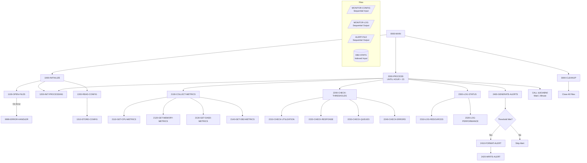
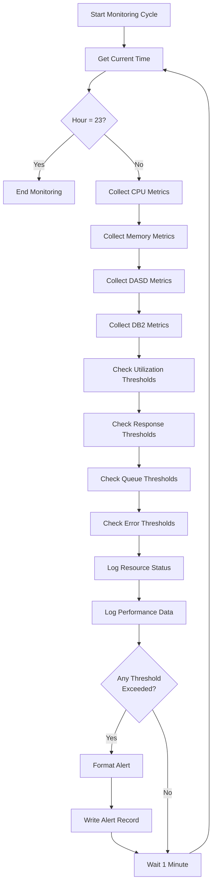

## Overview

UTLMON00 is a system monitoring utility that tracks system health and performance metrics on an ongoing basis. It collects resource utilization data, checks against configured thresholds, logs status information, and generates alerts when thresholds are exceeded.

The program monitors four key resource types:
- **CPU** - Processor utilization
- **Memory** - Memory utilization
- **DASD** - Direct Access Storage Device utilization
- **DB2** - Database performance metrics

The monitoring continues until the end of the monitoring period (23:00 hours), with configurable thresholds determining when alerts should be generated. This utility is essential for proactive system management and capacity planning.

## Program Structure



## Data Structures

### File Section

#### CONFIG-RECORD (MONITOR-CONFIG)

| Level | Name | Picture | Description |
|-------|------|---------|-------------|
| 01 | CONFIG-RECORD | - | Monitoring configuration record |
| 05 | CFG-RESOURCE-TYPE | X(10) | Resource being monitored |
| 05 | CFG-THRESHOLD-TYPE | X(10) | Type of threshold check |
| 05 | CFG-THRESHOLD-VALUE | 9(9)V99 | Threshold limit value |
| 05 | CFG-ALERT-LEVEL | X(10) | Alert severity level |
| 05 | CFG-ALERT-ACTION | X(50) | Action to take on alert |

#### LOG-RECORD (MONITOR-LOG)

| Level | Name | Picture | Description |
|-------|------|---------|-------------|
| 01 | LOG-RECORD | - | Monitoring log record |
| 05 | LOG-TIMESTAMP | X(26) | Time of metric collection |
| 05 | LOG-RESOURCE-TYPE | X(10) | Resource type |
| 05 | LOG-METRIC-NAME | X(20) | Name of metric |
| 05 | LOG-METRIC-VALUE | 9(9)V99 | Collected metric value |
| 05 | LOG-STATUS | X(10) | Current status |

#### ALERT-RECORD (ALERT-FILE)

| Level | Name | Picture | Description |
|-------|------|---------|-------------|
| 01 | ALERT-RECORD | - | Alert notification record |
| 05 | ALERT-TIMESTAMP | X(26) | Time alert was generated |
| 05 | ALERT-LEVEL | X(10) | Severity level |
| 05 | ALERT-RESOURCE | X(10) | Resource causing alert |
| 05 | ALERT-MESSAGE | X(80) | Alert description |

### Working Storage

#### WS-FILE-STATUS

| Level | Name | Picture | Description |
|-------|------|---------|-------------|
| 01 | WS-FILE-STATUS | - | File status codes group |
| 05 | WS-CFG-STATUS | XX | Config file status |
| 05 | WS-LOG-STATUS | XX | Log file status |
| 05 | WS-ALERT-STATUS | XX | Alert file status |
| 05 | WS-DB2-STATUS | XX | DB2 stats file status |

#### WS-RESOURCE-TYPES

| Level | Name | Picture | Value | Description |
|-------|------|---------|-------|-------------|
| 05 | WS-CPU | X(10) | 'CPU' | CPU resource identifier |
| 05 | WS-MEMORY | X(10) | 'MEMORY' | Memory resource identifier |
| 05 | WS-DASD | X(10) | 'DASD' | DASD resource identifier |
| 05 | WS-DB2 | X(10) | 'DB2' | DB2 resource identifier |

#### WS-THRESHOLD-TYPES

| Level | Name | Picture | Value | Description |
|-------|------|---------|-------|-------------|
| 05 | WS-UTILIZATION | X(10) | 'UTIL' | Utilization threshold |
| 05 | WS-RESPONSE | X(10) | 'RESPONSE' | Response time threshold |
| 05 | WS-QUEUE | X(10) | 'QUEUE' | Queue depth threshold |
| 05 | WS-ERROR | X(10) | 'ERROR' | Error count threshold |

#### WS-ALERT-LEVELS

| Level | Name | Picture | Value | Description |
|-------|------|---------|-------|-------------|
| 05 | WS-INFO | X(10) | 'INFO' | Informational alert |
| 05 | WS-WARNING | X(10) | 'WARNING' | Warning alert |
| 05 | WS-CRITICAL | X(10) | 'CRITICAL' | Critical alert |

#### WS-PROCESSING-FLAGS

| Level | Name | Picture | Description |
|-------|------|---------|-------------|
| 05 | WS-END-OF-CONFIG | X | End of config file flag |
| 05 | WS-THRESHOLD-MET | X | Threshold exceeded flag |

**88-Level Conditions:**
- `END-OF-CONFIG` (Y) - All config records read
- `THRESHOLD-MET` (Y) - A threshold was exceeded

#### WS-CURRENT-METRICS

| Level | Name | Picture | Description |
|-------|------|---------|-------------|
| 05 | WS-CPU-UTIL | 9(3)V99 | Current CPU utilization % |
| 05 | WS-MEMORY-UTIL | 9(3)V99 | Current memory utilization % |
| 05 | WS-DASD-UTIL | 9(3)V99 | Current DASD utilization % |
| 05 | WS-DB2-UTIL | 9(3)V99 | Current DB2 utilization % |
| 05 | WS-DB2-RESP | 9(5)V99 | DB2 response time (ms) |
| 05 | WS-DB2-QUEUE | 9(5) | DB2 queue depth |
| 05 | WS-DB2-ERRORS | 9(5) | DB2 error count |

#### WS-TIMESTAMP

| Level | Name | Picture | Description |
|-------|------|---------|-------------|
| 01 | WS-TIMESTAMP | - | Current timestamp |
| 05 | WS-DATE | - | Date portion |
| 10 | WS-YEAR | 9(4) | Year (YYYY) |
| 10 | WS-MONTH | 9(2) | Month (MM) |
| 10 | WS-DAY | 9(2) | Day (DD) |
| 05 | WS-TIME | - | Time portion |
| 10 | WS-HOUR | 9(2) | Hour (HH) |
| 10 | WS-MINUTE | 9(2) | Minute (MM) |
| 10 | WS-SECOND | 9(2) | Second (SS) |
| 10 | WS-HUNDREDTH | 9(2) | Hundredths of second |

## File I/O

### MONITOR-CONFIG

| Attribute | Value |
|-----------|-------|
| Logical Name | MONITOR-CONFIG |
| DD Name | MONCFG |
| Organization | Sequential |
| Access Mode | Sequential |
| Open Mode | Input |
| Recording Mode | Fixed (F) |
| File Status | WS-CFG-STATUS |

Contains threshold configuration records defining what to monitor and alert thresholds.

### MONITOR-LOG

| Attribute | Value |
|-----------|-------|
| Logical Name | MONITOR-LOG |
| DD Name | MONLOG |
| Organization | Sequential |
| Access Mode | Sequential |
| Open Mode | Output |
| Recording Mode | Fixed (F) |
| File Status | WS-LOG-STATUS |

Receives all collected metrics for historical analysis and reporting.

### ALERT-FILE

| Attribute | Value |
|-----------|-------|
| Logical Name | ALERT-FILE |
| DD Name | ALERTS |
| Organization | Sequential |
| Access Mode | Sequential |
| Open Mode | Output |
| File Status | WS-ALERT-STATUS |

Contains generated alerts when thresholds are exceeded.

### DB2-STATS

| Attribute | Value |
|-----------|-------|
| Logical Name | DB2-STATS |
| DD Name | DB2STATS |
| Organization | Indexed |
| Access Mode | Dynamic |
| Record Key | STAT-KEY |
| Open Mode | Input |
| File Status | WS-DB2-STATUS |

Indexed file containing DB2 performance statistics for monitoring.

## Control Flow

### Main Processing Logic

1. **0000-MAIN** - Program entry point
   - Initializes the monitoring environment
   - Loops through monitoring cycle until hour 23
   - Cleans up and exits

2. **1000-INITIALIZE** - Setup
   - Opens all files
   - Initializes processing variables
   - Reads configuration thresholds

3. **1100-OPEN-FILES** - File Handling
   - Opens MONITOR-CONFIG for input
   - Opens MONITOR-LOG for output
   - Opens ALERT-FILE for output
   - Opens DB2-STATS for input
   - Calls error handler on any failure

4. **1200-INIT-PROCESSING** - Time Update
   - Accepts current timestamp from system

5. **1300-READ-CONFIG** - Load Configuration
   - Reads all configuration records
   - Stores threshold definitions for monitoring

6. **2000-PROCESS** - Main Monitoring Loop
   - Collects current metrics
   - Checks against thresholds
   - Logs status information
   - Generates alerts if needed
   - Waits one minute (via ILBOABN0)
   - Updates timestamp
   - Repeats until hour 23

7. **2100-COLLECT-METRICS** - Metric Collection
   - Gets CPU metrics (2110)
   - Gets memory metrics (2120)
   - Gets DASD metrics (2130)
   - Gets DB2 metrics (2140)

8. **2200-CHECK-THRESHOLDS** - Threshold Evaluation
   - Checks utilization levels (2210)
   - Checks response times (2220)
   - Checks queue depths (2230)
   - Checks error counts (2240)

9. **2300-LOG-STATUS** - Status Logging
   - Logs resource utilization (2310)
   - Logs performance metrics (2320)

10. **2400-GENERATE-ALERTS** - Alert Processing
    - If threshold met, formats alert (2410)
    - Writes alert record (2420)

11. **3000-CLEANUP** - Termination
    - Closes all files

### Monitoring Cycle



## Dependencies

### Copybooks

- **DB2STAT** - DB2 statistics record structure for reading performance data
- **RTNCODE** - Return code management definitions
- **ERRHAND** - Standard error handling definitions

### Called Programs

| Program | Purpose |
|---------|---------|
| ILBOABN0 | IBM Language Environment routine for time delay (wait) |

### Related Programs

**Programs using RTNCODE:**
- RPTAUD00, RPTPOS00, RPTSTA00
- RTNCDE00
- TSTGEN00, TSTVAL00
- UTLMNT00, UTLVAL00

**Programs using ERRHAND:**
- BCHCTL00, HISTLD00, PRCSEQ00, RCVPRC00
- RPTAUD00, RPTPOS00, RPTSTA00
- DB2CMT, DB2CONN, DB2ERR, DB2STAT
- ERRPROC, PORTTEST, PORTTRAN
- TSTGEN00, TSTVAL00
- UTLMNT00, UTLVAL00

**Programs using DB2STAT:**
- RPTSTA00 - DB2 Statistics Report

## Technical Notes

### COBOL Concepts Used

- **SPECIAL-NAMES CONSOLE**: The `CONSOLE IS CONS` declaration allows using `DISPLAY ... UPON CONS` to write messages directly to the operator console.

- **ACCEPT FROM TIME**: Retrieves the current system time into the WS-TIMESTAMP structure with components for year, month, day, hour, minute, second, and hundredths.

- **PERFORM UNTIL**: The main processing loop `PERFORM 2000-PROCESS UNTIL WS-HOUR = 23` continues monitoring until 11:00 PM.

- **Dynamic File Access**: DB2-STATS uses dynamic access mode, allowing both sequential and random access to statistics records.

### Time Delay Mechanism

The program uses `CALL 'ILBOABN0' USING WS-MINUTE` to pause execution between monitoring cycles. ILBOABN0 is an IBM Language Environment routine that provides a time delay. The WS-MINUTE field controls the wait duration.

### Monitoring Thresholds

The configuration file defines thresholds for different metric types:

| Threshold Type | Description | Example Use |
|----------------|-------------|-------------|
| UTIL | Utilization percentage | CPU > 90% |
| RESPONSE | Response time | DB2 response > 500ms |
| QUEUE | Queue depth | DB2 queue > 100 |
| ERROR | Error count | Errors > 10 |

### Alert Levels

| Level | Description | Typical Use |
|-------|-------------|-------------|
| INFO | Informational | Metrics within normal range |
| WARNING | Warning | Approaching threshold |
| CRITICAL | Critical | Threshold exceeded |

### Return Codes

| Code | Meaning |
|------|---------|
| 0 | Successful completion |
| 12 | Error occurred (file open failure) |

### JCL Requirements

```jcl
//UTLMON00 EXEC PGM=UTLMON00
//MONCFG   DD DSN=your.monitor.config,DISP=SHR
//MONLOG   DD DSN=your.monitor.log,DISP=(NEW,CATLG,DELETE),
//            DCB=(RECFM=FB,LRECL=80,BLKSIZE=0)
//ALERTS   DD DSN=your.alert.file,DISP=(NEW,CATLG,DELETE),
//            DCB=(RECFM=FB,LRECL=126,BLKSIZE=0)
//DB2STATS DD DSN=your.db2.stats,DISP=SHR
//SYSOUT   DD SYSOUT=*
```

### Configuration File Format

Each configuration record specifies a monitoring threshold:

| Position | Length | Field | Description |
|----------|--------|-------|-------------|
| 1-10 | 10 | Resource Type | CPU, MEMORY, DASD, DB2 |
| 11-20 | 10 | Threshold Type | UTIL, RESPONSE, QUEUE, ERROR |
| 21-31 | 11 | Threshold Value | Numeric limit (9(9)V99) |
| 32-41 | 10 | Alert Level | INFO, WARNING, CRITICAL |
| 42-91 | 50 | Alert Action | Action description |

**Example Configuration:**

```
CPU       UTIL      000000090.00WARNING   Page operations team if sustained
MEMORY    UTIL      000000085.00WARNING   Check for memory leaks
DB2       RESPONSE  000000500.00CRITICAL  Escalate to DBA team
DB2       QUEUE     000000100.00WARNING   Monitor for growth
```

### Operational Considerations

- The program runs continuously until 23:00 hours
- Metrics are collected every minute
- All metrics are logged regardless of threshold status
- Alerts are only generated when thresholds are exceeded
- The program should be started at the beginning of the monitoring period
- Consider using a job scheduler to manage program execution
