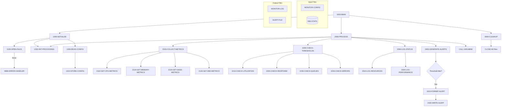

## Overview

UTLMON00 is a system monitoring utility program that provides continuous health and performance monitoring for the mainframe environment. It collects metrics from multiple resource types (CPU, memory, DASD, and DB2), compares them against configurable thresholds, logs status information, and generates alerts when thresholds are exceeded.

The program operates as a long-running batch job that runs continuously until a specified end time (hour 23). It reads monitoring configuration from a parameter file, periodically collects system metrics, and writes both status logs and alert records based on the collected data.

UTLMON00 is designed to support operations teams by providing early warning of potential resource constraints or performance issues. The alert file can be used to trigger automated responses or notifications to system administrators.

## Program Structure



## Data Structures

### File Section

#### MONITOR-CONFIG (CONFIG-RECORD)

Configuration file defining monitoring thresholds:

| Level | Name | Picture | Description |
|-------|------|---------|-------------|
| 01 | CONFIG-RECORD | | Threshold configuration record |
| 05 | CFG-RESOURCE-TYPE | X(10) | Resource to monitor (CPU, MEMORY, DASD, DB2) |
| 05 | CFG-THRESHOLD-TYPE | X(10) | Type of threshold (UTIL, RESPONSE, QUEUE, ERROR) |
| 05 | CFG-THRESHOLD-VALUE | 9(9)V99 | Threshold value |
| 05 | CFG-ALERT-LEVEL | X(10) | Alert severity (INFO, WARNING, CRITICAL) |
| 05 | CFG-ALERT-ACTION | X(50) | Action to take when threshold exceeded |

#### MONITOR-LOG (LOG-RECORD)

Status log file for performance metrics:

| Level | Name | Picture | Description |
|-------|------|---------|-------------|
| 01 | LOG-RECORD | | Performance log record |
| 05 | LOG-TIMESTAMP | X(26) | When the metric was collected |
| 05 | LOG-RESOURCE-TYPE | X(10) | Resource type |
| 05 | LOG-METRIC-NAME | X(20) | Name of the metric |
| 05 | LOG-METRIC-VALUE | 9(9)V99 | Current metric value |
| 05 | LOG-STATUS | X(10) | Status indicator |

#### ALERT-FILE (ALERT-RECORD)

Alert output file for threshold violations:

| Level | Name | Picture | Description |
|-------|------|---------|-------------|
| 01 | ALERT-RECORD | | Alert notification record |
| 05 | ALERT-TIMESTAMP | X(26) | When the alert was generated |
| 05 | ALERT-LEVEL | X(10) | Alert severity level |
| 05 | ALERT-RESOURCE | X(10) | Resource that triggered alert |
| 05 | ALERT-MESSAGE | X(80) | Alert message text |

#### DB2-STATS

Indexed file containing DB2 statistics (from DB2STAT copybook). Used for reading DB2 performance data.

### Working Storage

#### File Status (WS-FILE-STATUS)

| Level | Name | Picture | Description |
|-------|------|---------|-------------|
| 05 | WS-CFG-STATUS | XX | Config file status |
| 05 | WS-LOG-STATUS | XX | Log file status |
| 05 | WS-ALERT-STATUS | XX | Alert file status |
| 05 | WS-DB2-STATUS | XX | DB2 stats file status |

#### Resource Types (WS-RESOURCE-TYPES)

| Level | Name | Picture | Value | Description |
|-------|------|---------|-------|-------------|
| 05 | WS-CPU | X(10) | 'CPU' | CPU resource identifier |
| 05 | WS-MEMORY | X(10) | 'MEMORY' | Memory resource identifier |
| 05 | WS-DASD | X(10) | 'DASD' | DASD resource identifier |
| 05 | WS-DB2 | X(10) | 'DB2' | DB2 resource identifier |

#### Threshold Types (WS-THRESHOLD-TYPES)

| Level | Name | Picture | Value | Description |
|-------|------|---------|-------|-------------|
| 05 | WS-UTILIZATION | X(10) | 'UTIL' | Utilization threshold |
| 05 | WS-RESPONSE | X(10) | 'RESPONSE' | Response time threshold |
| 05 | WS-QUEUE | X(10) | 'QUEUE' | Queue depth threshold |
| 05 | WS-ERROR | X(10) | 'ERROR' | Error count threshold |

#### Alert Levels (WS-ALERT-LEVELS)

| Level | Name | Picture | Value | Description |
|-------|------|---------|-------|-------------|
| 05 | WS-INFO | X(10) | 'INFO' | Informational alert |
| 05 | WS-WARNING | X(10) | 'WARNING' | Warning alert |
| 05 | WS-CRITICAL | X(10) | 'CRITICAL' | Critical alert |

#### Processing Flags (WS-PROCESSING-FLAGS)

| Level | Name | Picture | Initial | Description |
|-------|------|---------|---------|-------------|
| 05 | WS-END-OF-CONFIG | X | 'N' | End of config file flag |
| 05 | WS-THRESHOLD-MET | X | 'N' | Threshold exceeded flag |

**88-level Conditions:**
- END-OF-CONFIG - Value 'Y'
- THRESHOLD-MET - Value 'Y'

#### Current Metrics (WS-CURRENT-METRICS)

| Level | Name | Picture | Description |
|-------|------|---------|-------------|
| 05 | WS-CPU-UTIL | 9(3)V99 | Current CPU utilization % |
| 05 | WS-MEMORY-UTIL | 9(3)V99 | Current memory utilization % |
| 05 | WS-DASD-UTIL | 9(3)V99 | Current DASD utilization % |
| 05 | WS-DB2-UTIL | 9(3)V99 | Current DB2 utilization % |
| 05 | WS-DB2-RESP | 9(5)V99 | DB2 response time (ms) |
| 05 | WS-DB2-QUEUE | 9(5) | DB2 queue depth |
| 05 | WS-DB2-ERRORS | 9(5) | DB2 error count |

#### Timestamp (WS-TIMESTAMP)

| Level | Name | Picture | Description |
|-------|------|---------|-------------|
| 05 | WS-DATE | | Date component |
| 10 | WS-YEAR | 9(4) | Year (YYYY) |
| 10 | WS-MONTH | 9(2) | Month (MM) |
| 10 | WS-DAY | 9(2) | Day (DD) |
| 05 | WS-TIME | | Time component |
| 10 | WS-HOUR | 9(2) | Hour (HH) |
| 10 | WS-MINUTE | 9(2) | Minute (MM) |
| 10 | WS-SECOND | 9(2) | Second (SS) |
| 10 | WS-HUNDREDTH | 9(2) | Hundredths of second |

## File I/O

### MONITOR-CONFIG

| Property | Value |
|----------|-------|
| Logical Name | MONITOR-CONFIG |
| Physical Assignment | MONCFG |
| Organization | Sequential |
| Recording Mode | Fixed (F) |
| Access Mode | Sequential |
| File Status | WS-CFG-STATUS |
| Open Mode | Input |

Configuration file containing threshold definitions read at startup.

### MONITOR-LOG

| Property | Value |
|----------|-------|
| Logical Name | MONITOR-LOG |
| Physical Assignment | MONLOG |
| Organization | Sequential |
| Recording Mode | Fixed (F) |
| Access Mode | Sequential |
| File Status | WS-LOG-STATUS |
| Open Mode | Output |

Status log file written with periodic metric snapshots.

### ALERT-FILE

| Property | Value |
|----------|-------|
| Logical Name | ALERT-FILE |
| Physical Assignment | ALERTS |
| Organization | Sequential |
| Recording Mode | Fixed (F) |
| File Status | WS-ALERT-STATUS |
| Open Mode | Output |

Alert file written when thresholds are exceeded.

### DB2-STATS

| Property | Value |
|----------|-------|
| Logical Name | DB2-STATS |
| Physical Assignment | DB2STATS |
| Organization | Indexed (VSAM KSDS) |
| Access Mode | Dynamic |
| Record Key | STAT-KEY |
| File Status | WS-DB2-STATUS |
| Open Mode | Input |

DB2 statistics file for retrieving database performance metrics.

## Control Flow

### Main Processing (0000-MAIN)

The program runs as a continuous monitoring loop:

1. **Initialize** - Open files, get initial timestamp, read configuration
2. **Process Loop** - Execute until WS-HOUR = 23 (11 PM)
3. **Cleanup** - Close all files
4. **GOBACK** - Return to operating system

### Initialization (1000-INITIALIZE)

1. **1100-OPEN-FILES**: Opens all four files
   - MONITOR-CONFIG for input
   - MONITOR-LOG for output
   - ALERT-FILE for output
   - DB2-STATS for input
   - If any file fails to open, calls 9999-ERROR-HANDLER

2. **1200-INIT-PROCESSING**: Accepts current time from system

3. **1300-READ-CONFIG**: Reads all configuration records
   - Loops until END-OF-CONFIG
   - Calls 1310-STORE-CONFIG for each record

### Processing Loop (2000-PROCESS)

Executed repeatedly until hour 23:

1. **2100-COLLECT-METRICS**: Gathers current system metrics
   - 2110-GET-CPU-METRICS: CPU utilization
   - 2120-GET-MEMORY-METRICS: Memory utilization
   - 2130-GET-DASD-METRICS: DASD utilization
   - 2140-GET-DB2-METRICS: DB2 statistics

2. **2200-CHECK-THRESHOLDS**: Compares metrics against thresholds
   - 2210-CHECK-UTILIZATION: Resource utilization thresholds
   - 2220-CHECK-RESPONSE: Response time thresholds
   - 2230-CHECK-QUEUES: Queue depth thresholds
   - 2240-CHECK-ERRORS: Error count thresholds

3. **2300-LOG-STATUS**: Writes status to log file
   - 2310-LOG-RESOURCES: Resource utilization data
   - 2320-LOG-PERFORMANCE: Performance metrics

4. **2400-GENERATE-ALERTS**: Creates alerts if needed
   - If THRESHOLD-MET is true:
     - 2410-FORMAT-ALERT: Formats alert message
     - 2420-WRITE-ALERT: Writes alert record

5. **CALL ILBOABN0**: Pauses execution (delay)

6. **1200-INIT-PROCESSING**: Refreshes timestamp for next iteration

### Cleanup (3000-CLEANUP)

Closes all four files in a single CLOSE statement.

### Error Handler (9999-ERROR-HANDLER)

1. Displays error message to console (CONS)
2. Sets RETURN-CODE to 12 (severe error)
3. Terminates with GOBACK

## Dependencies

### Copybooks
- DB2STAT - DB2 statistics record layout
- RTNCODE - Return code management structure
- ERRHAND - Standard error handling definitions

### Called Programs

| Program | Purpose |
|---------|---------|
| ILBOABN0 | IBM Language Environment delay routine |

### Related Programs

**DB2STAT copybook:**
- RPTSTA00 - Status report generator

**RTNCODE copybook:**
- RPTAUD00, RPTPOS00, RPTSTA00 - Report programs
- RTNCDE00 - Return code analyzer
- TSTGEN00, TSTVAL00 - Test programs
- UTLMNT00, UTLVAL00 - Other utility programs

**ERRHAND copybook:**
- Multiple batch, DB2, and utility programs

## JCL Requirements

Example JCL for executing UTLMON00:

```jcl
//UTLMON00 EXEC PGM=UTLMON00
//STEPLIB  DD DSN=your.loadlib,DISP=SHR
//MONCFG   DD DSN=your.monitor.config,DISP=SHR
//MONLOG   DD DSN=your.monitor.log,
//            DISP=(NEW,CATLG,DELETE),
//            DCB=(RECFM=FB,LRECL=76,BLKSIZE=0),
//            SPACE=(CYL,(5,5),RLSE)
//ALERTS   DD DSN=your.alert.file,
//            DISP=(NEW,CATLG,DELETE),
//            DCB=(RECFM=FB,LRECL=126,BLKSIZE=0),
//            SPACE=(CYL,(1,1),RLSE)
//DB2STATS DD DSN=your.db2.stats.vsam,DISP=SHR
//SYSOUT   DD SYSOUT=*
```

### Configuration File Format (MONCFG)

Fixed-length 91-byte records:
- Positions 1-10: Resource Type (CPU, MEMORY, DASD, DB2)
- Positions 11-20: Threshold Type (UTIL, RESPONSE, QUEUE, ERROR)
- Positions 21-31: Threshold Value (9(9)V99)
- Positions 32-41: Alert Level (INFO, WARNING, CRITICAL)
- Positions 42-91: Alert Action (description/command)

**Example Configuration:**

```
CPU       UTIL      000000090.00WARNING   Notify operations team
MEMORY    UTIL      000000085.00WARNING   Notify operations team
DB2       RESPONSE  000001000.00CRITICAL  Page DBA on-call
DB2       QUEUE     000000050.00WARNING   Monitor closely
```

## Return Codes

| Code | Meaning |
|------|---------|
| 0 | Successful completion |
| 12 | Severe error (file open failure) |

## Monitored Metrics

### Resource Utilization

| Resource | Metric | Description |
|----------|--------|-------------|
| CPU | WS-CPU-UTIL | Processor utilization percentage |
| MEMORY | WS-MEMORY-UTIL | Real storage utilization percentage |
| DASD | WS-DASD-UTIL | DASD I/O utilization percentage |
| DB2 | WS-DB2-UTIL | DB2 subsystem utilization |

### DB2 Performance

| Metric | Field | Description |
|--------|-------|-------------|
| Response Time | WS-DB2-RESP | Average SQL response time (ms) |
| Queue Depth | WS-DB2-QUEUE | Number of requests waiting |
| Error Count | WS-DB2-ERRORS | Cumulative SQL errors |

## Technical Notes

### SPECIAL-NAMES CONSOLE

The program uses `SPECIAL-NAMES. CONSOLE IS CONS.` to define CONS as the system console. This allows `DISPLAY ... UPON CONS` to write messages directly to the operator console.

### ILBOABN0 Delay

The program calls `ILBOABN0` (IBM Language Environment abnormal termination routine) with WS-MINUTE to introduce a delay between monitoring iterations. This prevents the program from consuming excessive CPU cycles while polling for metrics.

### Continuous Operation

The program runs until WS-HOUR equals 23 (11 PM), providing nearly 24-hour monitoring coverage when started at midnight. For true 24/7 monitoring, the job would need to be scheduled to restart daily.

### Dynamic File Access

The DB2-STATS file uses dynamic access mode, allowing both sequential and random access to statistics records. This enables efficient retrieval of specific statistics by key or sequential scanning for comprehensive data collection.

### Threshold-Based Alerting

Alerts are only generated when THRESHOLD-MET is true, preventing alert flooding. The program sets this flag in the 2200-CHECK-THRESHOLDS routine when any metric exceeds its configured threshold.
