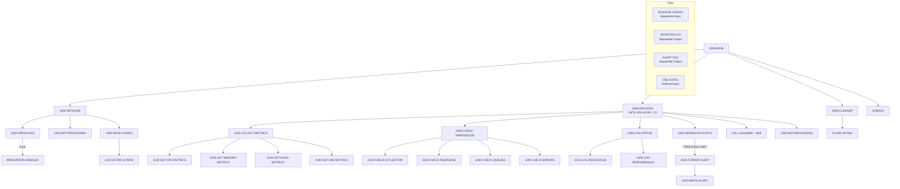

## Overview

UTLMON00 is a system monitoring utility program that provides comprehensive health and performance monitoring for mainframe systems. It continuously collects metrics, checks thresholds, logs status information, and generates alerts when conditions warrant attention.

Key features:
- **Resource Utilization Tracking**: Monitors CPU, memory, DASD, and DB2 utilization
- **Performance Metrics Collection**: Gathers response times, queue depths, and error counts
- **Threshold Monitoring**: Compares metrics against configurable thresholds
- **Alert Generation**: Creates alerts when thresholds are exceeded
- **Continuous Operation**: Runs in a loop until end-of-day (hour 23)

This program is typically run as a long-running batch job or started task to provide ongoing system monitoring throughout the business day.

## Program Structure



## Data Structures

### File Section

#### CONFIG-RECORD (MONITOR-CONFIG)

| Level | Name | Picture | Description |
|-------|------|---------|-------------|
| 01 | CONFIG-RECORD | - | Configuration record |
| 05 | CFG-RESOURCE-TYPE | X(10) | Resource type (CPU, MEMORY, DASD, DB2) |
| 05 | CFG-THRESHOLD-TYPE | X(10) | Threshold type (UTIL, RESPONSE, QUEUE, ERROR) |
| 05 | CFG-THRESHOLD-VALUE | 9(9)V99 | Threshold value |
| 05 | CFG-ALERT-LEVEL | X(10) | Alert severity (INFO, WARNING, CRITICAL) |
| 05 | CFG-ALERT-ACTION | X(50) | Action to take when threshold exceeded |

#### LOG-RECORD (MONITOR-LOG)

| Level | Name | Picture | Description |
|-------|------|---------|-------------|
| 01 | LOG-RECORD | - | Monitor log record |
| 05 | LOG-TIMESTAMP | X(26) | Log entry timestamp |
| 05 | LOG-RESOURCE-TYPE | X(10) | Resource being logged |
| 05 | LOG-METRIC-NAME | X(20) | Metric name |
| 05 | LOG-METRIC-VALUE | 9(9)V99 | Metric value |
| 05 | LOG-STATUS | X(10) | Status indicator |

#### ALERT-RECORD (ALERT-FILE)

| Level | Name | Picture | Description |
|-------|------|---------|-------------|
| 01 | ALERT-RECORD | - | Alert record |
| 05 | ALERT-TIMESTAMP | X(26) | Alert timestamp |
| 05 | ALERT-LEVEL | X(10) | Alert severity level |
| 05 | ALERT-RESOURCE | X(10) | Resource that triggered alert |
| 05 | ALERT-MESSAGE | X(80) | Alert message text |

#### DB2-STATS (Indexed File)

Uses the DB2STAT copybook for DB2 statistics record structure. The file is accessed by STAT-KEY.

### Working Storage

#### File Status Variables

| Level | Name | Picture | Description |
|-------|------|---------|-------------|
| 01 | WS-FILE-STATUS | - | File status group |
| 05 | WS-CFG-STATUS | XX | Config file status |
| 05 | WS-LOG-STATUS | XX | Log file status |
| 05 | WS-ALERT-STATUS | XX | Alert file status |
| 05 | WS-DB2-STATUS | XX | DB2 stats file status |

#### Resource Type Constants

| Level | Name | Picture | Value | Description |
|-------|------|---------|-------|-------------|
| 01 | WS-RESOURCE-TYPES | - | - | Resource identifiers |
| 05 | WS-CPU | X(10) | `'CPU'` | CPU resource |
| 05 | WS-MEMORY | X(10) | `'MEMORY'` | Memory resource |
| 05 | WS-DASD | X(10) | `'DASD'` | Disk storage |
| 05 | WS-DB2 | X(10) | `'DB2'` | Database |

#### Threshold Type Constants

| Level | Name | Picture | Value | Description |
|-------|------|---------|-------|-------------|
| 01 | WS-THRESHOLD-TYPES | - | - | Threshold identifiers |
| 05 | WS-UTILIZATION | X(10) | `'UTIL'` | Utilization threshold |
| 05 | WS-RESPONSE | X(10) | `'RESPONSE'` | Response time threshold |
| 05 | WS-QUEUE | X(10) | `'QUEUE'` | Queue depth threshold |
| 05 | WS-ERROR | X(10) | `'ERROR'` | Error count threshold |

#### Alert Level Constants

| Level | Name | Picture | Value | Description |
|-------|------|---------|-------|-------------|
| 01 | WS-ALERT-LEVELS | - | - | Alert severity levels |
| 05 | WS-INFO | X(10) | `'INFO'` | Informational alert |
| 05 | WS-WARNING | X(10) | `'WARNING'` | Warning alert |
| 05 | WS-CRITICAL | X(10) | `'CRITICAL'` | Critical alert |

#### Processing Flags

| Level | Name | Picture | Value | Description |
|-------|------|---------|-------|-------------|
| 01 | WS-PROCESSING-FLAGS | - | - | Processing flags |
| 05 | WS-END-OF-CONFIG | X | `'N'` | Config EOF indicator |
| 05 | WS-THRESHOLD-MET | X | `'N'` | Threshold exceeded flag |

##### End of Config (WS-END-OF-CONFIG)

| Value | 88-Level Name | Meaning |
|-------|---------------|---------|
| `'Y'` | END-OF-CONFIG | All config records read |
| `'N'` | - | More config records |

##### Threshold Met (WS-THRESHOLD-MET)

| Value | 88-Level Name | Meaning |
|-------|---------------|---------|
| `'Y'` | THRESHOLD-MET | Threshold was exceeded |
| `'N'` | - | Within normal range |

#### Current Metrics

| Level | Name | Picture | Description |
|-------|------|---------|-------------|
| 01 | WS-CURRENT-METRICS | - | Current metric values |
| 05 | WS-CPU-UTIL | 9(3)V99 | CPU utilization % |
| 05 | WS-MEMORY-UTIL | 9(3)V99 | Memory utilization % |
| 05 | WS-DASD-UTIL | 9(3)V99 | DASD utilization % |
| 05 | WS-DB2-UTIL | 9(3)V99 | DB2 utilization % |
| 05 | WS-DB2-RESP | 9(5)V99 | DB2 response time (ms) |
| 05 | WS-DB2-QUEUE | 9(5) | DB2 queue depth |
| 05 | WS-DB2-ERRORS | 9(5) | DB2 error count |

#### Timestamp Structure

| Level | Name | Picture | Description |
|-------|------|---------|-------------|
| 01 | WS-TIMESTAMP | - | Current timestamp |
| 05 | WS-DATE | - | Date portion |
| 10 | WS-YEAR | 9(4) | Year (YYYY) |
| 10 | WS-MONTH | 9(2) | Month (MM) |
| 10 | WS-DAY | 9(2) | Day (DD) |
| 05 | WS-TIME | - | Time portion |
| 10 | WS-HOUR | 9(2) | Hour (HH) |
| 10 | WS-MINUTE | 9(2) | Minute (MM) |
| 10 | WS-SECOND | 9(2) | Second (SS) |
| 10 | WS-HUNDREDTH | 9(2) | Hundredths of second |

## File I/O

### MONITOR-CONFIG

| Property | Value |
|----------|-------|
| DD Name | MONCFG |
| Organization | SEQUENTIAL |
| Recording Mode | F (Fixed) |
| File Status | WS-CFG-STATUS |
| Open Mode | INPUT |

Configuration file containing threshold definitions and alert rules.

### MONITOR-LOG

| Property | Value |
|----------|-------|
| DD Name | MONLOG |
| Organization | SEQUENTIAL |
| Recording Mode | F (Fixed) |
| File Status | WS-LOG-STATUS |
| Open Mode | OUTPUT |

Log file for recording metric snapshots and status information.

### ALERT-FILE

| Property | Value |
|----------|-------|
| DD Name | ALERTS |
| Organization | SEQUENTIAL |
| Recording Mode | F (Fixed) |
| File Status | WS-ALERT-STATUS |
| Open Mode | OUTPUT |

Output file for generated alerts when thresholds are exceeded.

### DB2-STATS

| Property | Value |
|----------|-------|
| DD Name | DB2STATS |
| Organization | INDEXED (VSAM KSDS) |
| Access Mode | DYNAMIC |
| Record Key | STAT-KEY |
| File Status | WS-DB2-STATUS |
| Open Mode | INPUT |

DB2 statistics file providing database performance metrics.

### File Operations Summary

| Paragraph | File | Operation |
|-----------|------|-----------|
| 1100-OPEN-FILES | MONITOR-CONFIG | OPEN INPUT |
| 1100-OPEN-FILES | MONITOR-LOG | OPEN OUTPUT |
| 1100-OPEN-FILES | ALERT-FILE | OPEN OUTPUT |
| 1100-OPEN-FILES | DB2-STATS | OPEN INPUT |
| 1300-READ-CONFIG | MONITOR-CONFIG | READ |
| 2300-LOG-STATUS | MONITOR-LOG | WRITE (implied) |
| 2420-WRITE-ALERT | ALERT-FILE | WRITE (implied) |
| 2140-GET-DB2-METRICS | DB2-STATS | READ (implied) |
| 3000-CLEANUP | All files | CLOSE |

## Control Flow

### 0000-MAIN

The main entry point that orchestrates continuous monitoring:
1. **PERFORM 1000-INITIALIZE**: Set up files and load configuration
2. **PERFORM 2000-PROCESS UNTIL WS-HOUR = 23**: Monitor loop until 11 PM
3. **PERFORM 3000-CLEANUP**: Close files
4. **GOBACK**: Return to caller

### 1000-INITIALIZE

Performs program initialization:
1. **1100-OPEN-FILES**: Opens all four files with error checking
2. **1200-INIT-PROCESSING**: Gets current timestamp
3. **1300-READ-CONFIG**: Loads threshold configuration

### 1100-OPEN-FILES

Opens all files and checks status:
- MONITOR-CONFIG (INPUT)
- MONITOR-LOG (OUTPUT)
- ALERT-FILE (OUTPUT)
- DB2-STATS (INPUT)

If any file fails to open, displays error message to console and terminates with return code 12.

### 1200-INIT-PROCESSING

Accepts the current timestamp from the system using `ACCEPT WS-TIMESTAMP FROM TIME`.

### 1300-READ-CONFIG

Reads all configuration records in a loop:
1. **READ MONITOR-CONFIG**: Reads next config record
   - AT END: Sets END-OF-CONFIG flag
   - NOT AT END: Performs 1310-STORE-CONFIG

### 2000-PROCESS

Main monitoring cycle (repeated each interval):
1. **2100-COLLECT-METRICS**: Gather current metrics
2. **2200-CHECK-THRESHOLDS**: Compare against thresholds
3. **2300-LOG-STATUS**: Write to monitor log
4. **2400-GENERATE-ALERTS**: Create alerts if needed
5. **CALL 'ILBOABN0'**: Wait for next interval
6. **1200-INIT-PROCESSING**: Refresh timestamp

### 2100-COLLECT-METRICS

Collects metrics from all monitored resources:
- **2110-GET-CPU-METRICS**: CPU utilization
- **2120-GET-MEMORY-METRICS**: Memory utilization
- **2130-GET-DASD-METRICS**: DASD utilization
- **2140-GET-DB2-METRICS**: DB2 utilization, response time, queue depth, errors

### 2200-CHECK-THRESHOLDS

Compares current metrics against configured thresholds:
- **2210-CHECK-UTILIZATION**: Resource utilization checks
- **2220-CHECK-RESPONSE**: Response time checks
- **2230-CHECK-QUEUES**: Queue depth checks
- **2240-CHECK-ERRORS**: Error count checks

Sets THRESHOLD-MET flag when any threshold is exceeded.

### 2300-LOG-STATUS

Logs current status to the monitor log:
1. Moves timestamp to LOG-TIMESTAMP
2. **2310-LOG-RESOURCES**: Logs resource utilization
3. **2320-LOG-PERFORMANCE**: Logs performance metrics

### 2400-GENERATE-ALERTS

Generates alerts when thresholds are exceeded:
1. Checks if THRESHOLD-MET is true
2. **2410-FORMAT-ALERT**: Formats the alert message
3. **2420-WRITE-ALERT**: Writes to alert file

### 3000-CLEANUP

Closes all files in a single CLOSE statement.

### 9999-ERROR-HANDLER

Error handling routine:
1. Displays error message to console (CONS)
2. Sets RETURN-CODE to 12
3. Terminates via GOBACK

## Monitoring Cycle

```
┌─────────────────────────────────────────────────────────────┐
│                  UTLMON00 Monitoring Cycle                   │
├─────────────────────────────────────────────────────────────┤
│                                                              │
│  ┌──────────────────────────────────────────────────────┐   │
│  │                    2000-PROCESS                       │   │
│  │  (Repeats until WS-HOUR = 23)                        │   │
│  │                                                       │   │
│  │  ┌─────────────┐    ┌─────────────┐                  │   │
│  │  │  Collect    │───►│   Check     │                  │   │
│  │  │  Metrics    │    │ Thresholds  │                  │   │
│  │  └─────────────┘    └──────┬──────┘                  │   │
│  │                            │                          │   │
│  │  ┌─────────────┐    ┌──────▼──────┐                  │   │
│  │  │   Log       │◄───│  Generate   │                  │   │
│  │  │   Status    │    │   Alerts    │                  │   │
│  │  └─────────────┘    └─────────────┘                  │   │
│  │                            │                          │   │
│  │                     ┌──────▼──────┐                  │   │
│  │                     │    Wait     │                  │   │
│  │                     │  (ILBOABN0) │                  │   │
│  │                     └──────┬──────┘                  │   │
│  │                            │                          │   │
│  └────────────────────────────┴──────────────────────────┘   │
│                                                              │
│  Output Files:                                              │
│  ├── MONITOR-LOG: Periodic status snapshots                 │
│  └── ALERT-FILE: Threshold violation alerts                 │
│                                                              │
└─────────────────────────────────────────────────────────────┘
```

## Sample Configuration File

```
CPU       UTIL      00000085.00WARNING   NOTIFY OPERATIONS                         
CPU       UTIL      00000095.00CRITICAL  PAGE SYSADMIN                             
MEMORY    UTIL      00000080.00WARNING   NOTIFY OPERATIONS                         
MEMORY    UTIL      00000090.00CRITICAL  PAGE SYSADMIN                             
DASD      UTIL      00000075.00WARNING   NOTIFY STORAGE ADMIN                      
DB2       RESPONSE  00000500.00WARNING   NOTIFY DBA                                
DB2       RESPONSE  00001000.00CRITICAL  PAGE DBA                                  
DB2       QUEUE     00000050.00WARNING   NOTIFY DBA                                
DB2       ERROR     00000010.00CRITICAL  PAGE DBA AND SYSADMIN                     
```

## Sample JCL

```jcl
//UTLMON00 EXEC PGM=UTLMON00,TIME=1440
//STEPLIB  DD DSN=your.loadlib,DISP=SHR
//MONCFG   DD DSN=your.monitor.config,DISP=SHR
//MONLOG   DD DSN=your.monitor.log,
//            DISP=(NEW,CATLG,DELETE),
//            DCB=(RECFM=FB,LRECL=77,BLKSIZE=0),
//            SPACE=(TRK,(50,25),RLSE)
//ALERTS   DD DSN=your.alert.file,
//            DISP=(NEW,CATLG,DELETE),
//            DCB=(RECFM=FB,LRECL=126,BLKSIZE=0),
//            SPACE=(TRK,(10,5),RLSE)
//DB2STATS DD DSN=your.db2.stats.vsam,DISP=SHR
//SYSOUT   DD SYSOUT=*
```

Note: `TIME=1440` allows the job to run for a full day (1440 minutes).

## Dependencies

### Copybooks

- **DB2STAT** - DB2 statistics record layout
- **RTNCODE** - Return code management structure
- **ERRHAND** - Error handling definitions

### Called Programs

| Program | Purpose |
|---------|---------|
| **ILBOABN0** | IBM Language Environment service for delay/wait |

### Related Programs

Programs that consume the output files:
- Alert processing systems that read ALERT-FILE
- Reporting programs that analyze MONITOR-LOG
- Automation tools that respond to alerts

## Return Codes

| Code | Meaning |
|------|---------|
| 0 | Successful completion (normal end at hour 23) |
| 12 | Error during processing (file open failure) |

## Technical Notes

### COBOL Constructs Used

- **SPECIAL-NAMES CONSOLE IS CONS**: Defines CONS as an alias for the system console, allowing `DISPLAY ... UPON CONS` to write directly to the operator console.

- **ACCEPT FROM TIME**: Retrieves the current system time into WS-TIMESTAMP in the format HHMMSSCC (hour, minute, second, hundredths).

- **PERFORM UNTIL**: The main processing loop continues until WS-HOUR equals 23 (11 PM), providing continuous monitoring throughout the business day.

- **CALL 'ILBOABN0'**: Calls the IBM Language Environment abnormal termination routine. In this context, it's being used with WS-MINUTE to create a wait/delay between monitoring cycles. Note: This is an unusual usage; typically a wait service like CEE3DLY would be used.

- **DYNAMIC Access Mode**: The DB2-STATS file uses dynamic access, allowing both sequential and random access to statistics records.

### Monitoring Interval

The program waits between monitoring cycles using ILBOABN0 with WS-MINUTE as a parameter. The exact wait behavior depends on the system configuration.

### Threshold Configuration

The configuration file allows flexible definition of:
- Which resources to monitor
- What types of thresholds to apply
- Threshold values
- Alert severity levels
- Actions to take when thresholds are exceeded

### Resource Metrics

| Resource | Metrics Collected |
|----------|-------------------|
| CPU | Utilization percentage |
| Memory | Utilization percentage |
| DASD | Utilization percentage |
| DB2 | Utilization %, response time, queue depth, error count |

### Alert Severity Levels

| Level | Usage |
|-------|-------|
| INFO | Informational, no action required |
| WARNING | Attention needed, but not urgent |
| CRITICAL | Immediate action required |
