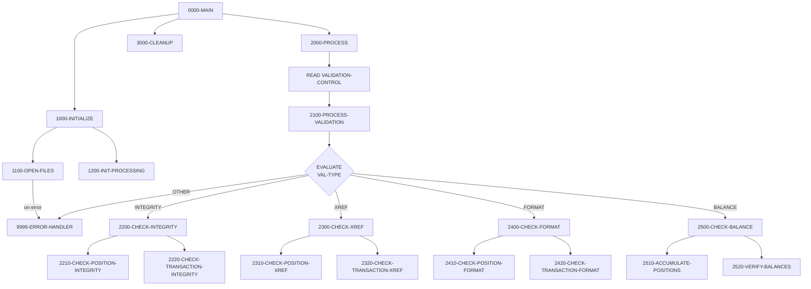

## Overview

UTLVAL00 is a batch utility program that performs comprehensive data validation on portfolio and transaction files. It is designed to be run as part of regular data quality processes to ensure data integrity across the system.

The program supports four validation types, controlled by a sequential input file:
- **INTEGRITY** - Verifies record integrity for positions and transactions
- **XREF** - Cross-reference validation between related records
- **FORMAT** - Field format verification against expected patterns
- **BALANCE** - Balance reconciliation and control total verification

Key features include:
- **Configurable validation** - Control file specifies which validations to run
- **Comprehensive error reporting** - All errors written to a detailed report file
- **Multiple file validation** - Validates both position and transaction data
- **Statistics tracking** - Counts records read, valid, and in error
- **Balance verification** - Compares accumulated totals against control totals

This utility is typically scheduled to run after batch updates to verify data quality before downstream processing or reporting.

## Program Structure



## Data Structures

### Working Storage

#### File Status

| Level | Name | Picture | Description |
|-------|------|---------|-------------|
| 01 | WS-FILE-STATUS | - | File status group |
| 05 | WS-VAL-STATUS | PIC XX | Validation control file status |
| 05 | WS-POS-STATUS | PIC XX | Position master file status |
| 05 | WS-TRAN-STATUS | PIC XX | Transaction history file status |
| 05 | WS-RPT-STATUS | PIC XX | Error report file status |

#### Validation Types

| Level | Name | Picture | Value | Description |
|-------|------|---------|-------|-------------|
| 05 | WS-INTEGRITY | PIC X(10) | `'INTEGRITY'` | Integrity check type |
| 05 | WS-XREF | PIC X(10) | `'XREF'` | Cross-reference check type |
| 05 | WS-FORMAT | PIC X(10) | `'FORMAT'` | Format check type |
| 05 | WS-BALANCE | PIC X(10) | `'BALANCE'` | Balance check type |

#### Processing Flags

| Level | Name | Picture | Description |
|-------|------|---------|-------------|
| 05 | WS-END-OF-VAL | PIC X | End of validation control file flag |
| 05 | WS-ERROR-FOUND | PIC X | Error detected flag |

#### Processing Flag Conditions (88-Levels)

| Condition Name | Value | Description |
|----------------|-------|-------------|
| END-OF-VALIDATION | `Y` | All validation records processed |
| ERROR-FOUND | `Y` | At least one error detected |

#### Validation Totals

| Level | Name | Picture | Description |
|-------|------|---------|-------------|
| 05 | WS-RECORDS-READ | PIC 9(9) | Count of records read |
| 05 | WS-RECORDS-VALID | PIC 9(9) | Count of valid records |
| 05 | WS-RECORDS-ERROR | PIC 9(9) | Count of error records |
| 05 | WS-TOTAL-AMOUNT | PIC S9(15)V99 | Accumulated amount total |
| 05 | WS-CONTROL-TOTAL | PIC S9(15)V99 | Expected control total |

#### Error Line

| Level | Name | Picture | Description |
|-------|------|---------|-------------|
| 01 | WS-ERROR-LINE | - | Error report line structure |
| 05 | WS-ERR-TYPE | PIC X(10) | Validation type that failed |
| 05 | WS-ERR-KEY | PIC X(20) | Record key of failing record |
| 05 | WS-ERR-DESC | PIC X(98) | Error description |

### File Section

#### Validation Control Record

| Level | Name | Picture | Description |
|-------|------|---------|-------------|
| 01 | VALIDATION-RECORD | - | Validation control record |
| 05 | VAL-TYPE | PIC X(10) | Validation type to perform |
| 05 | VAL-PARAMETERS | PIC X(70) | Parameters for the validation |

#### Error Report Record

| Level | Name | Picture | Description |
|-------|------|---------|-------------|
| 01 | ERROR-RECORD | PIC X(132) | Error report output line |

### Position Record (from POSREC copybook)

| Level | Name | Picture | Description |
|-------|------|---------|-------------|
| 01 | POSITION-RECORD | - | Position master record |
| 05 | POS-KEY | - | Composite record key |
| 10 | POS-PORTFOLIO-ID | PIC X(08) | Portfolio identifier |
| 10 | POS-DATE | PIC X(08) | Position date (YYYYMMDD) |
| 10 | POS-INVESTMENT-ID | PIC X(10) | Investment identifier |
| 05 | POS-DATA | - | Position data fields |
| 10 | POS-QUANTITY | PIC S9(11)V9(4) COMP-3 | Holding quantity |
| 10 | POS-COST-BASIS | PIC S9(13)V9(2) COMP-3 | Total cost basis |
| 10 | POS-MARKET-VALUE | PIC S9(13)V9(2) COMP-3 | Current market value |
| 10 | POS-STATUS | PIC X(01) | Status: `A`=Active, `C`=Closed, `P`=Pending |

### Transaction Record (from TRNREC copybook)

| Level | Name | Picture | Description |
|-------|------|---------|-------------|
| 01 | TRANSACTION-RECORD | - | Transaction history record |
| 05 | TRAN-KEY | - | Composite record key |
| 10 | TRN-DATE | PIC X(08) | Transaction date (YYYYMMDD) |
| 10 | TRN-TIME | PIC X(06) | Transaction time (HHMMSS) |
| 10 | TRN-PORTFOLIO-ID | PIC X(08) | Portfolio identifier |
| 10 | TRN-SEQUENCE-NO | PIC X(06) | Sequence number |
| 05 | TRN-DATA | - | Transaction data fields |
| 10 | TRN-TYPE | PIC X(02) | Type: `BU`=Buy, `SL`=Sell, `TR`=Transfer, `FE`=Fee |
| 10 | TRN-AMOUNT | PIC S9(13)V9(2) COMP-3 | Transaction amount |
| 10 | TRN-STATUS | PIC X(01) | Status: `P`=Pending, `D`=Done, `F`=Failed, `R`=Reversed |

## File I/O

### File Definitions

| Logical Name | DD Name | Organization | Access Mode | Record Key | Description |
|--------------|---------|--------------|-------------|------------|-------------|
| VALIDATION-CONTROL | VALCTL | Sequential | Sequential | - | Input file specifying validations to run |
| POSITION-MASTER | POSMSTRE | Indexed (VSAM KSDS) | Dynamic | POS-KEY | Position master file to validate |
| TRANSACTION-HISTORY | TRANHIST | Indexed (VSAM KSDS) | Dynamic | TRAN-KEY | Transaction history file to validate |
| ERROR-REPORT | ERRRPT | Sequential | Sequential | - | Output error report (132-byte fixed) |

### File Operations Summary

| Paragraph | File | Operation | Purpose |
|-----------|------|-----------|---------|
| 1100-OPEN-FILES | VALIDATION-CONTROL | OPEN INPUT | Open control file for reading |
| 1100-OPEN-FILES | POSITION-MASTER | OPEN INPUT | Open positions for validation |
| 1100-OPEN-FILES | TRANSACTION-HISTORY | OPEN INPUT | Open transactions for validation |
| 1100-OPEN-FILES | ERROR-REPORT | OPEN OUTPUT | Open error report for writing |
| 2000-PROCESS | VALIDATION-CONTROL | READ | Read next validation request |
| 9999-ERROR-HANDLER | ERROR-RECORD | WRITE | Write error to report |
| 3000-CLEANUP | All files | CLOSE | Close all files |

## Control Flow

### 0000-MAIN

The main entry point that orchestrates the validation process:
1. Initialize files and counters
2. Process all validation requests
3. Clean up and close files

### 1000-INITIALIZE

Prepares the program for validation:
1. **1100-OPEN-FILES**: Opens all four files with error checking
2. **1200-INIT-PROCESSING**: Initializes validation totals to zero

### 2000-PROCESS

Main processing loop that reads the validation control file:
```cobol
PERFORM UNTIL END-OF-VALIDATION
    READ VALIDATION-CONTROL
        AT END
            SET END-OF-VALIDATION TO TRUE
        NOT AT END
            PERFORM 2100-PROCESS-VALIDATION
    END-READ
END-PERFORM
```

### 2100-PROCESS-VALIDATION

Dispatches to the appropriate validation routine based on `VAL-TYPE`:

| VAL-TYPE | Paragraph Called | Description |
|----------|------------------|-------------|
| `INTEGRITY` | 2200-CHECK-INTEGRITY | Record integrity validation |
| `XREF` | 2300-CHECK-XREF | Cross-reference validation |
| `FORMAT` | 2400-CHECK-FORMAT | Field format validation |
| `BALANCE` | 2500-CHECK-BALANCE | Balance reconciliation |
| Other | 9999-ERROR-HANDLER | Invalid type error |

### 2200-CHECK-INTEGRITY (Integrity Validation)

Validates record integrity for both file types:
- **2210-CHECK-POSITION-INTEGRITY**: Validates position records
- **2220-CHECK-TRANSACTION-INTEGRITY**: Validates transaction records

Typical integrity checks include:
- Required fields are populated
- Key fields are valid
- Status codes are valid values
- Dates are in valid format

### 2300-CHECK-XREF (Cross-Reference Validation)

Validates relationships between records:
- **2310-CHECK-POSITION-XREF**: Validates position cross-references
- **2320-CHECK-TRANSACTION-XREF**: Validates transaction cross-references

Typical cross-reference checks include:
- Portfolio IDs exist in master files
- Investment IDs are valid
- Transaction references valid positions

### 2400-CHECK-FORMAT (Format Validation)

Validates field formats against expected patterns:
- **2410-CHECK-POSITION-FORMAT**: Validates position field formats
- **2420-CHECK-TRANSACTION-FORMAT**: Validates transaction field formats

Typical format checks include:
- Date fields are YYYYMMDD format
- Numeric fields contain valid numbers
- Code fields contain valid values
- Currency codes are valid

### 2500-CHECK-BALANCE (Balance Reconciliation)

Verifies that calculated totals match expected control totals:
- **2510-ACCUMULATE-POSITIONS**: Sums position values into `WS-TOTAL-AMOUNT`
- **2520-VERIFY-BALANCES**: Compares `WS-TOTAL-AMOUNT` to `WS-CONTROL-TOTAL`

This validation type ensures:
- Position totals match expected values
- No records are missing or duplicated
- Monetary amounts are accurate

### 9999-ERROR-HANDLER

Centralized error handling that:
1. Increments `WS-RECORDS-ERROR` counter
2. Sets `ERROR-FOUND` flag to TRUE
3. Moves error message to error line description
4. Writes error record to the ERROR-REPORT file

## Dependencies

### Copybooks

- **POSREC** - Position record structure defining the POSITION-MASTER file layout
- **TRNREC** - Transaction record structure defining the TRANSACTION-HISTORY file layout
- **RTNCODE** - Return code management definitions
- **ERRHAND** - Standard error handling definitions including `WS-ERROR-MESSAGE`

### Called Programs

This program does not call any external programs.

### Related Programs

Programs that share the POSREC copybook (position data):
- RPTPOS00 - Position report generator
- INQPORT - Portfolio inquiry

Programs that share the TRNREC copybook (transaction data):
- RPTPOS00 - Position report generator
- PORTTRAN - Portfolio transaction processing
- TSTGEN00 - Test data generation

Programs that share the RTNCODE copybook:
- RPTAUD00 - Audit report generator
- RPTPOS00 - Position report generator
- RPTSTA00 - Status report generator
- RTNCDE00 - Return code handler
- TSTGEN00, TSTVAL00 - Test utilities
- UTLMNT00, UTLMON00 - Maintenance and monitoring utilities

## Validation Control File Format

The VALIDATION-CONTROL file contains records that specify which validations to run:

```
INTEGRITY (parameters...)
XREF      (parameters...)
FORMAT    (parameters...)
BALANCE   (parameters...)
```

Each record is 80 bytes:
- Positions 1-10: Validation type
- Positions 11-80: Parameters specific to the validation type

### Example Control File

```
INTEGRITY ALL
XREF      PORTFOLIO
FORMAT    DATES
BALANCE   PORTFOLIO
```

## Error Report Format

The ERROR-REPORT file contains 132-byte fixed-length records:

| Position | Length | Field | Description |
|----------|--------|-------|-------------|
| 1-10 | 10 | Error Type | Validation type that failed |
| 13-32 | 20 | Record Key | Key of the failing record |
| 35-132 | 98 | Description | Error description |

### Example Error Report

```
INTEGRITY PORT00001/20240320/INV001 Missing required field: POS-QUANTITY
FORMAT    PORT00002/20240321/INV002 Invalid date format: POS-DATE
XREF      PORT00003/20240322/INV003 Portfolio ID not found in master
BALANCE   CONTROL                    Balance mismatch: Expected 100000.00, Got 99500.00
```

## Technical Notes

### SPECIAL-NAMES

The program includes:
```cobol
SPECIAL-NAMES.
    CONSOLE IS CONS.
```
This defines `CONS` as an alias for the console, allowing `DISPLAY ... UPON CONS` for operator messages.

### Dynamic Access Mode

The POSITION-MASTER and TRANSACTION-HISTORY files use `ACCESS MODE IS DYNAMIC`, allowing:
- Sequential reads for full file validation
- Random reads for cross-reference lookups

### RECORDING MODE IS F

The control and report files use `RECORDING MODE IS F` (Fixed), indicating:
- Fixed-length records
- No record descriptor word (RDW)
- Standard for sequential files on z/OS

### Statistics Tracking

The program maintains validation statistics:
- `WS-RECORDS-READ`: Incremented for each record processed
- `WS-RECORDS-VALID`: Incremented for each valid record
- `WS-RECORDS-ERROR`: Incremented for each error found

These can be used for job completion reporting and quality metrics.
