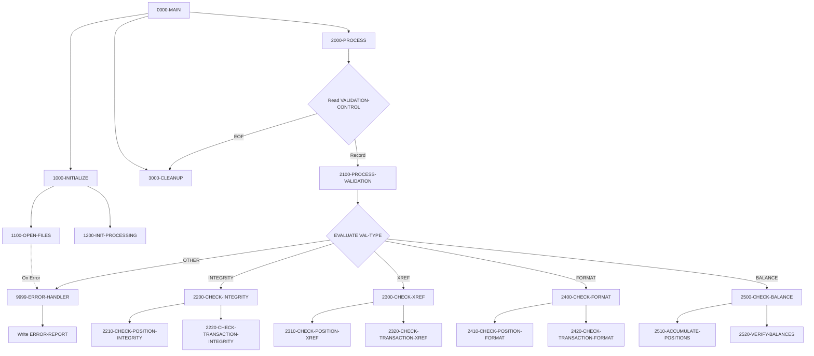

## Overview

UTLVAL00 is a batch utility program that performs comprehensive data validation across portfolio management data files. It provides a flexible, control-file-driven approach to validating data quality through multiple validation types that can be configured and executed in sequence.

The program validates data in the Position Master and Transaction History files, producing an error report detailing any issues found. It supports four types of validation:

- **INTEGRITY** - Verifies internal data consistency within records
- **XREF** - Cross-reference validation between related files
- **FORMAT** - Validates data format compliance
- **BALANCE** - Reconciles computed totals against control totals

This utility is typically run as part of end-of-day processing or data migration activities to ensure data quality before critical batch processes execute.

## Program Structure



## Data Structures

### Working Storage

#### File Status Codes

| Level | Name | Picture | Description |
|-------|------|---------|-------------|
| 01 | WS-FILE-STATUS | | File status group |
| 05 | WS-VAL-STATUS | XX | Validation Control file status |
| 05 | WS-POS-STATUS | XX | Position Master file status |
| 05 | WS-TRAN-STATUS | XX | Transaction History file status |
| 05 | WS-RPT-STATUS | XX | Error Report file status |

#### Validation Type Constants

| Level | Name | Picture | Value | Description |
|-------|------|---------|-------|-------------|
| 01 | WS-VALIDATION-TYPES | | | Type code constants |
| 05 | WS-INTEGRITY | X(10) | 'INTEGRITY' | Integrity check type |
| 05 | WS-XREF | X(10) | 'XREF' | Cross-reference type |
| 05 | WS-FORMAT | X(10) | 'FORMAT' | Format check type |
| 05 | WS-BALANCE | X(10) | 'BALANCE' | Balance check type |

#### Processing Flags

| Level | Name | Picture | Description |
|-------|------|---------|-------------|
| 01 | WS-PROCESSING-FLAGS | | Control flags |
| 05 | WS-END-OF-VAL | X | End of validation control file |
| 05 | WS-ERROR-FOUND | X | Error detected flag |

#### Validation Totals

| Level | Name | Picture | Description |
|-------|------|---------|-------------|
| 01 | WS-VALIDATION-TOTALS | | Statistics counters |
| 05 | WS-RECORDS-READ | 9(9) | Records read counter |
| 05 | WS-RECORDS-VALID | 9(9) | Valid records counter |
| 05 | WS-RECORDS-ERROR | 9(9) | Error records counter |
| 05 | WS-TOTAL-AMOUNT | S9(15)V99 | Computed total amount |
| 05 | WS-CONTROL-TOTAL | S9(15)V99 | Expected control total |

#### Error Line Format

| Level | Name | Picture | Description |
|-------|------|---------|-------------|
| 01 | WS-ERROR-LINE | | Error report line |
| 05 | WS-ERR-TYPE | X(10) | Validation type |
| 05 | WS-ERR-KEY | X(20) | Record key |
| 05 | WS-ERR-DESC | X(98) | Error description |

### File Section

#### Validation Control Record

| Level | Name | Picture | Description |
|-------|------|---------|-------------|
| 01 | VALIDATION-RECORD | | Control file record |
| 05 | VAL-TYPE | X(10) | Validation type code |
| 05 | VAL-PARAMETERS | X(70) | Validation parameters |

#### Error Report Record

| Level | Name | Picture | Description |
|-------|------|---------|-------------|
| 01 | ERROR-RECORD | X(132) | Error report line |

### Position Record (POSREC Copybook)

| Level | Name | Picture | Description |
|-------|------|---------|-------------|
| 01 | POSITION-RECORD | | Position master record |
| 05 | POS-KEY | | Composite key |
| 10 | POS-PORTFOLIO-ID | X(8) | Portfolio identifier |
| 10 | POS-DATE | X(8) | Position date (YYYYMMDD) |
| 10 | POS-INVESTMENT-ID | X(10) | Investment identifier |
| 05 | POS-DATA | | Position data |
| 10 | POS-QUANTITY | S9(11)V9(4) COMP-3 | Holding quantity |
| 10 | POS-COST-BASIS | S9(13)V9(2) COMP-3 | Total cost basis |
| 10 | POS-MARKET-VALUE | S9(13)V9(2) COMP-3 | Current market value |
| 10 | POS-STATUS | X(1) | A=Active, C=Closed, P=Pending |

### Transaction Record (TRNREC Copybook)

| Level | Name | Picture | Description |
|-------|------|---------|-------------|
| 01 | TRANSACTION-RECORD | | Transaction history record |
| 05 | TRN-KEY | | Composite key |
| 10 | TRN-DATE | X(8) | Transaction date (YYYYMMDD) |
| 10 | TRN-TIME | X(6) | Transaction time (HHMMSS) |
| 10 | TRN-PORTFOLIO-ID | X(8) | Portfolio identifier |
| 10 | TRN-SEQUENCE-NO | X(6) | Sequence number |
| 05 | TRN-DATA | | Transaction data |
| 10 | TRN-TYPE | X(2) | BU=Buy, SL=Sell, TR=Transfer, FE=Fee |
| 10 | TRN-AMOUNT | S9(13)V9(2) COMP-3 | Transaction amount |
| 10 | TRN-STATUS | X(1) | P=Pending, D=Done, F=Failed, R=Reversed |

## File I/O

### File Definitions

| File Name | DD Name | Type | Organization | Access Mode | Key |
|-----------|---------|------|--------------|-------------|-----|
| VALIDATION-CONTROL | VALCTL | Input | Sequential | Sequential | N/A |
| POSITION-MASTER | POSMSTRE | Input | Indexed (VSAM) | Dynamic | POS-KEY |
| TRANSACTION-HISTORY | TRANHIST | Input | Indexed (VSAM) | Dynamic | TRAN-KEY |
| ERROR-REPORT | ERRRPT | Output | Sequential | Sequential | N/A |

### File Operations

| Paragraph | File | Operation | Purpose |
|-----------|------|-----------|---------|
| 1100-OPEN-FILES | VALIDATION-CONTROL | OPEN INPUT | Read validation requests |
| 1100-OPEN-FILES | POSITION-MASTER | OPEN INPUT | Validate position data |
| 1100-OPEN-FILES | TRANSACTION-HISTORY | OPEN INPUT | Validate transaction data |
| 1100-OPEN-FILES | ERROR-REPORT | OPEN OUTPUT | Write validation errors |
| 2000-PROCESS | VALIDATION-CONTROL | READ | Get next validation type |
| 9999-ERROR-HANDLER | ERROR-REPORT | WRITE | Log validation errors |
| 3000-CLEANUP | All files | CLOSE | Release resources |

## Control Flow

### 1000-INITIALIZE

Initialization phase:
1. **1100-OPEN-FILES**: Opens all four files with error checking
   - VALIDATION-CONTROL for input (sequential read)
   - POSITION-MASTER for input (dynamic access)
   - TRANSACTION-HISTORY for input (dynamic access)
   - ERROR-REPORT for output
   - Any file open error triggers 9999-ERROR-HANDLER
2. **1200-INIT-PROCESSING**: Initializes validation totals to zero

### 2000-PROCESS

Main processing loop:
1. Reads VALIDATION-CONTROL file sequentially
2. On EOF, sets END-OF-VALIDATION flag
3. For each record, calls 2100-PROCESS-VALIDATION
4. Continues until all validation requests processed

### 2100-PROCESS-VALIDATION

Validation dispatcher:
- Evaluates VAL-TYPE field against validation constants
- Routes to appropriate validation routine:
  - `INTEGRITY` → 2200-CHECK-INTEGRITY
  - `XREF` → 2300-CHECK-XREF
  - `FORMAT` → 2400-CHECK-FORMAT
  - `BALANCE` → 2500-CHECK-BALANCE
- Invalid type triggers error handler

### 2200-CHECK-INTEGRITY

Data integrity validation:
1. **2210-CHECK-POSITION-INTEGRITY**: Validates position record internal consistency
   - Verifies required fields are populated
   - Checks numeric fields for valid values
   - Validates status codes

2. **2220-CHECK-TRANSACTION-INTEGRITY**: Validates transaction record consistency
   - Verifies transaction amounts
   - Checks date/time validity
   - Validates transaction types and statuses

### 2300-CHECK-XREF

Cross-reference validation:
1. **2310-CHECK-POSITION-XREF**: Validates position cross-references
   - Verifies portfolio IDs exist
   - Validates investment ID references

2. **2320-CHECK-TRANSACTION-XREF**: Validates transaction cross-references
   - Ensures transactions reference valid positions
   - Verifies portfolio linkages

### 2400-CHECK-FORMAT

Format validation:
1. **2410-CHECK-POSITION-FORMAT**: Validates position field formats
   - Date format validation (YYYYMMDD)
   - Numeric field format checking
   - Code field value validation

2. **2420-CHECK-TRANSACTION-FORMAT**: Validates transaction field formats
   - Date/time format validation
   - Amount format verification
   - Type code validation

### 2500-CHECK-BALANCE

Balance reconciliation:
1. **2510-ACCUMULATE-POSITIONS**: Accumulates position values
   - Sums market values or quantities
   - Builds computed total in WS-TOTAL-AMOUNT

2. **2520-VERIFY-BALANCES**: Compares against control totals
   - Validates WS-TOTAL-AMOUNT against WS-CONTROL-TOTAL
   - Reports discrepancies to error file

### 9999-ERROR-HANDLER

Error processing:
1. Increments WS-RECORDS-ERROR counter
2. Sets ERROR-FOUND flag to TRUE
3. Moves error message to WS-ERR-DESC
4. Writes formatted error line to ERROR-REPORT

### 3000-CLEANUP

Termination:
- Closes all four files
- Program ends after cleanup completes

## Validation Control File Format

The VALIDATION-CONTROL file drives the validation process. Each record specifies a validation type and optional parameters:

```
INTEGRITY [parameters]
XREF      [parameters]
FORMAT    [parameters]
BALANCE   [control-total]
```

### Example Control File

```
INTEGRITY POSITIONS
INTEGRITY TRANSACTIONS
XREF      PORTFOLIO-LINKS
FORMAT    DATE-FIELDS
FORMAT    AMOUNT-FIELDS
BALANCE   1234567890.12
```

## Error Report Format

The ERROR-REPORT file contains 132-character records:

```
TYPE       KEY                  DESCRIPTION
---------- -------------------- --------------------------------------------------
INTEGRITY  PORT001/20240320     Invalid status code: X
XREF       TRN00123456          Transaction references non-existent portfolio
FORMAT     PORT002/INV001       Invalid date format: 2024-03-20
BALANCE    TOTAL                Balance mismatch: computed 1000.00, expected 1500.00
```

## Dependencies

### Copybooks

- **POSREC** - Position record structure with key and data fields
- **TRNREC** - Transaction record structure with key and data fields
- **RTNCODE** - Return code management definitions
- **ERRHAND** - Standard error handling definitions

### Called Programs

None - this program does not call external programs.

### Related Programs

Programs that share copybooks with UTLVAL00:
- **RPTPOS00** - Position reporting (uses POSREC, TRNREC, RTNCODE, ERRHAND)
- **INQPORT** - Portfolio inquiry (uses POSREC)
- **PORTTRAN** - Portfolio transactions (uses TRNREC, ERRHAND)
- **TSTGEN00** - Test data generation (uses TRNREC, RTNCODE, ERRHAND)
- **UTLMNT00**, **UTLMON00** - Other utilities (use RTNCODE, ERRHAND)

## Technical Notes

### Dynamic File Access

The POSITION-MASTER and TRANSACTION-HISTORY files use `ACCESS MODE IS DYNAMIC`, allowing both:
- Sequential reading for full-file validation
- Random access by key for cross-reference lookups

This flexibility supports efficient validation strategies.

### Control-File-Driven Design

The validation control file approach provides:
- **Flexibility**: Different validation combinations per run
- **Reusability**: Same program for different validation scenarios
- **Auditability**: Control file documents what was validated
- **Configurability**: No code changes needed for different validations

### Validation Statistics

The program maintains counters for:
- `WS-RECORDS-READ`: Total records processed
- `WS-RECORDS-VALID`: Records passing validation
- `WS-RECORDS-ERROR`: Records with errors

These can be used for summary reporting and process monitoring.

### Balance Reconciliation

The balance check compares:
- `WS-TOTAL-AMOUNT`: Computed from actual data
- `WS-CONTROL-TOTAL`: Expected total (from control file or external source)

This provides assurance that data transformations or loads completed correctly.

### SPECIAL-NAMES Clause

The program uses `CONSOLE IS CONS` in SPECIAL-NAMES, which allows operator communication via the system console. This can be used for status messages or operator intervention.

### Error Handling Strategy

All file open errors and invalid validation types trigger the error handler, which:
1. Records the error for reporting
2. Sets the ERROR-FOUND flag
3. Continues processing (non-fatal approach)

This allows the program to report all errors found rather than stopping at the first one.
