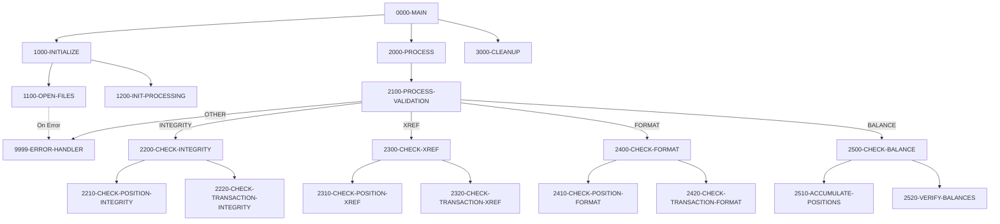

## Overview

UTLVAL00 is a batch utility program that performs comprehensive data validation across portfolio-related files. It reads validation control records that specify which types of validation to perform, then executes the appropriate validation routines against the Position Master and Transaction History files.

The program supports four types of validation:
- **Integrity** - Validates data consistency within records
- **Cross-Reference (XREF)** - Validates relationships between related records
- **Format** - Validates field formats and data types
- **Balance** - Reconciles calculated totals against control totals

All validation errors are written to an error report file for review and correction. This utility is typically run as part of data quality monitoring or before major processing runs to ensure data integrity.

## Program Structure



## Data Structures

### Working Storage

#### File Status Variables

| Level | Name | Picture | Description |
|-------|------|---------|-------------|
| 01 | WS-FILE-STATUS | - | File status group |
| 05 | WS-VAL-STATUS | PIC XX | Validation control file status |
| 05 | WS-POS-STATUS | PIC XX | Position master file status |
| 05 | WS-TRAN-STATUS | PIC XX | Transaction history file status |
| 05 | WS-RPT-STATUS | PIC XX | Error report file status |

#### Validation Type Constants

| Level | Name | Picture | Value | Description |
|-------|------|---------|-------|-------------|
| 05 | WS-INTEGRITY | PIC X(10) | 'INTEGRITY' | Integrity check type |
| 05 | WS-XREF | PIC X(10) | 'XREF' | Cross-reference check type |
| 05 | WS-FORMAT | PIC X(10) | 'FORMAT' | Format check type |
| 05 | WS-BALANCE | PIC X(10) | 'BALANCE' | Balance check type |

#### Processing Flags

| Level | Name | Picture | Default | Description |
|-------|------|---------|---------|-------------|
| 05 | WS-END-OF-VAL | PIC X | 'N' | End of validation control file flag |
| 05 | WS-ERROR-FOUND | PIC X | 'N' | Error found during validation flag |

#### Validation Totals

| Level | Name | Picture | Description |
|-------|------|---------|-------------|
| 05 | WS-RECORDS-READ | PIC 9(9) | Count of records read |
| 05 | WS-RECORDS-VALID | PIC 9(9) | Count of valid records |
| 05 | WS-RECORDS-ERROR | PIC 9(9) | Count of error records |
| 05 | WS-TOTAL-AMOUNT | PIC S9(15)V99 | Accumulated total amount |
| 05 | WS-CONTROL-TOTAL | PIC S9(15)V99 | Expected control total |

#### Error Line Layout

| Level | Name | Picture | Description |
|-------|------|---------|-------------|
| 01 | WS-ERROR-LINE | - | Error report line layout |
| 05 | WS-ERR-TYPE | PIC X(10) | Type of error |
| 05 | WS-ERR-KEY | PIC X(20) | Key of record in error |
| 05 | WS-ERR-DESC | PIC X(98) | Error description |

### Processing Flags (88-levels)

| Condition Name | Variable | Value | Description |
|----------------|----------|-------|-------------|
| END-OF-VALIDATION | WS-END-OF-VAL | 'Y' | All control records processed |
| ERROR-FOUND | WS-ERROR-FOUND | 'Y' | At least one error detected |

### File Section

#### Validation Control Record

| Level | Name | Picture | Description |
|-------|------|---------|-------------|
| 01 | VALIDATION-RECORD | - | Control record (80 bytes) |
| 05 | VAL-TYPE | PIC X(10) | Validation type to perform |
| 05 | VAL-PARAMETERS | PIC X(70) | Parameters for validation |

#### Error Report Record

| Level | Name | Picture | Description |
|-------|------|---------|-------------|
| 01 | ERROR-RECORD | PIC X(132) | Error report output line |

## File I/O

### File Definitions

| Logical Name | Physical Name | Organization | Access Mode | Record Key | Description |
|--------------|---------------|--------------|-------------|------------|-------------|
| VALIDATION-CONTROL | VALCTL | Sequential | Sequential | - | Input control file specifying validations |
| POSITION-MASTER | POSMSTRE | Indexed | Dynamic | POS-KEY | Position data to validate |
| TRANSACTION-HISTORY | TRANHIST | Indexed | Dynamic | TRAN-KEY | Transaction data to validate |
| ERROR-REPORT | ERRRPT | Sequential | Sequential | - | Output error report |

### File Operations Summary

| File | Operations | Mode | Paragraphs |
|------|------------|------|------------|
| VALIDATION-CONTROL | OPEN, READ, CLOSE | INPUT | 1100, 2000, 3000 |
| POSITION-MASTER | OPEN, READ, CLOSE | INPUT | 1100, 22xx, 23xx, 24xx, 25xx, 3000 |
| TRANSACTION-HISTORY | OPEN, READ, CLOSE | INPUT | 1100, 22xx, 23xx, 24xx, 3000 |
| ERROR-REPORT | OPEN, WRITE, CLOSE | OUTPUT | 1100, 9999, 3000 |

## Control Flow

### 0000-MAIN

Entry point orchestrating the validation process:
1. Performs initialization
2. Performs main processing loop
3. Performs cleanup
4. Returns to caller

### 1000-INITIALIZE

Prepares the program for execution:
1. Opens all files (1100-OPEN-FILES)
2. Initializes processing counters (1200-INIT-PROCESSING)

### 1100-OPEN-FILES

Opens all required files with error handling:
- VALIDATION-CONTROL (INPUT) - Control records
- POSITION-MASTER (INPUT) - Position data
- TRANSACTION-HISTORY (INPUT) - Transaction data
- ERROR-REPORT (OUTPUT) - Error output

Each file open is validated; errors trigger 9999-ERROR-HANDLER.

### 1200-INIT-PROCESSING

Initializes validation totals to zero.

### 2000-PROCESS

Main processing loop:
```
PERFORM UNTIL END-OF-VALIDATION
    READ VALIDATION-CONTROL
        AT END: SET END-OF-VALIDATION TO TRUE
        NOT AT END: PERFORM 2100-PROCESS-VALIDATION
END-PERFORM
```

### 2100-PROCESS-VALIDATION

Dispatches to appropriate validation routine based on VAL-TYPE:

| VAL-TYPE | Paragraph | Description |
|----------|-----------|-------------|
| INTEGRITY | 2200-CHECK-INTEGRITY | Data integrity checks |
| XREF | 2300-CHECK-XREF | Cross-reference validation |
| FORMAT | 2400-CHECK-FORMAT | Format verification |
| BALANCE | 2500-CHECK-BALANCE | Balance reconciliation |
| Other | 9999-ERROR-HANDLER | Invalid type error |

### 2200-CHECK-INTEGRITY

Performs data integrity validation:
1. **2210-CHECK-POSITION-INTEGRITY** - Validates position record integrity
   - Checks for required fields
   - Validates numeric fields contain valid numbers
   - Ensures logical consistency within position records
   
2. **2220-CHECK-TRANSACTION-INTEGRITY** - Validates transaction record integrity
   - Checks for required fields
   - Validates transaction dates and amounts
   - Ensures logical consistency within transaction records

### 2300-CHECK-XREF

Performs cross-reference validation:
1. **2310-CHECK-POSITION-XREF** - Validates position cross-references
   - Verifies positions reference valid accounts
   - Checks security IDs exist in reference tables
   
2. **2320-CHECK-TRANSACTION-XREF** - Validates transaction cross-references
   - Verifies transactions reference valid positions
   - Checks account relationships

### 2400-CHECK-FORMAT

Performs format verification:
1. **2410-CHECK-POSITION-FORMAT** - Validates position field formats
   - Checks date formats
   - Validates numeric field formats
   - Verifies code field values
   
2. **2420-CHECK-TRANSACTION-FORMAT** - Validates transaction field formats
   - Checks date and time formats
   - Validates amount formats
   - Verifies transaction type codes

### 2500-CHECK-BALANCE

Performs balance reconciliation:
1. **2510-ACCUMULATE-POSITIONS** - Accumulates position values
   - Reads all position records
   - Sums quantities and values
   - Stores totals in WS-TOTAL-AMOUNT
   
2. **2520-VERIFY-BALANCES** - Compares against control totals
   - Compares WS-TOTAL-AMOUNT to WS-CONTROL-TOTAL
   - Reports discrepancies

### 3000-CLEANUP

Closes all files:
- VALIDATION-CONTROL
- POSITION-MASTER
- TRANSACTION-HISTORY
- ERROR-REPORT

### 9999-ERROR-HANDLER

Centralized error handling:
1. Increments WS-RECORDS-ERROR counter
2. Sets ERROR-FOUND flag to TRUE
3. Moves error message to WS-ERR-DESC
4. Writes error line to ERROR-REPORT

## Validation Control File Format

The VALIDATION-CONTROL file contains records specifying which validations to perform:

```
INTEGRITY [parameters]
XREF      [parameters]
FORMAT    [parameters]
BALANCE   [parameters]
```

### Example Control File

```
INTEGRITY POSITIONS
INTEGRITY TRANSACTIONS
XREF      ALL
FORMAT    POSITIONS
FORMAT    TRANSACTIONS
BALANCE   DAILY
```

## Error Report Format

The ERROR-REPORT file uses a 132-character fixed-format layout:

| Position | Width | Field | Description |
|----------|-------|-------|-------------|
| 1-10 | 10 | Error Type | Type of validation that failed |
| 11-12 | 2 | Filler | Spacing |
| 13-32 | 20 | Record Key | Key of record in error |
| 33-34 | 2 | Filler | Spacing |
| 35-132 | 98 | Description | Error description text |

### Example Error Report

```
INTEGRITY  PORT0001234         Position quantity is negative
FORMAT     TRN20240315001      Invalid transaction date format
XREF       PORT0009999         Account reference not found
BALANCE    CONTROL             Total mismatch: expected 1000000.00, found 999875.50
```

## Dependencies

### Copybooks

- **POSREC** - Position record layout (defines POS-KEY and position fields)
- **TRNREC** - Transaction record layout (defines TRAN-KEY and transaction fields)
- **RTNCODE** - Return code definitions
- **ERRHAND** - Error handling structures (defines WS-ERROR-MESSAGE)

### Called Programs

None - this is a standalone utility program.

### Related Programs

Programs that share copybooks with UTLVAL00:

| Program | Shared Copybooks | Relationship |
|---------|------------------|--------------|
| RPTPOS00 | POSREC, TRNREC, RTNCODE, ERRHAND | Position reporting - uses same data files |
| INQPORT | POSREC | Portfolio inquiry |
| PORTTRAN | TRNREC, ERRHAND | Portfolio transactions |
| TSTGEN00 | TRNREC, RTNCODE, ERRHAND | Test data generation |
| TSTVAL00 | RTNCODE, ERRHAND | Test validation |
| UTLMNT00 | RTNCODE, ERRHAND | Maintenance utility |
| UTLMON00 | RTNCODE, ERRHAND | Monitoring utility |

## Technical Notes

### Dynamic File Access

The POSITION-MASTER and TRANSACTION-HISTORY files use DYNAMIC access mode, enabling:
- Sequential reads for full-file validation passes
- Random reads by key for cross-reference lookups

### SPECIAL-NAMES

The program uses `CONSOLE IS CONS` in SPECIAL-NAMES, allowing console output via:
```cobol
DISPLAY message UPON CONS
```

### Validation Strategy

The program is data-driven through the VALIDATION-CONTROL file:
- Multiple validation passes can be specified
- Validation types can be run selectively
- Parameters can customize validation behavior

### Error Accumulation

The program continues processing after errors:
- Errors are logged to ERROR-REPORT
- WS-RECORDS-ERROR tracks error count
- Processing completes all validation types
- Return code can be set based on error count

### JCL Requirements

```jcl
//VALCTL   DD DSN=validation.control.file,DISP=SHR
//POSMSTRE DD DSN=position.master.file,DISP=SHR
//TRANHIST DD DSN=transaction.history.file,DISP=SHR
//ERRRPT   DD DSN=error.report.file,
//            DISP=(NEW,CATLG),SPACE=(TRK,(10,5)),
//            DCB=(RECFM=FB,LRECL=132,BLKSIZE=0)
```

### Source File Note

The source file contains paragraph definitions for detailed validation routines (2210-2520) but their full implementations are not present in the reviewed source. The documentation above describes the expected behavior based on the program structure and naming conventions.
