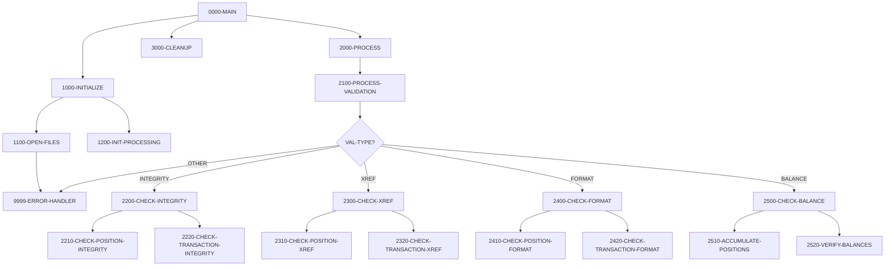

## Overview

UTLVAL00 is a batch utility program that performs comprehensive data validation across the portfolio management system's data files. It is a configurable validation engine that reads validation instructions from a control file and executes the appropriate checks against the Position Master and Transaction History files.

The program supports four categories of validation:

- **INTEGRITY**: Verifies internal consistency of records within each file
- **XREF**: Validates cross-references between related files
- **FORMAT**: Checks data format compliance against business rules
- **BALANCE**: Reconciles totals and verifies balance accuracy

All validation errors are written to an error report file for analysis and correction. The program maintains statistics on records processed, valid records, and error counts to provide a summary of data quality.

This utility is typically run as part of nightly batch processing or before major operations to ensure data integrity across the system.

## Program Structure



## Data Structures

### File Section

#### Validation Control Record

| Level | Name | Picture | Description |
|-------|------|---------|-------------|
| 01 | VALIDATION-RECORD | - | Validation instruction record |
| 05 | VAL-TYPE | X(10) | Validation type (see table below) |
| 05 | VAL-PARAMETERS | X(70) | Parameters for the validation |

#### Error Report Record

| Level | Name | Picture | Description |
|-------|------|---------|-------------|
| 01 | ERROR-RECORD | X(132) | 132-byte error report line |

### Working Storage

#### File Status Variables

| Level | Name | Picture | Description |
|-------|------|---------|-------------|
| 05 | WS-VAL-STATUS | XX | Validation control file status |
| 05 | WS-POS-STATUS | XX | Position master file status |
| 05 | WS-TRAN-STATUS | XX | Transaction history file status |
| 05 | WS-RPT-STATUS | XX | Error report file status |

#### Validation Type Constants

| Level | Name | Picture | Value | Description |
|-------|------|---------|-------|-------------|
| 05 | WS-INTEGRITY | X(10) | 'INTEGRITY' | Integrity check type |
| 05 | WS-XREF | X(10) | 'XREF' | Cross-reference check type |
| 05 | WS-FORMAT | X(10) | 'FORMAT' | Format check type |
| 05 | WS-BALANCE | X(10) | 'BALANCE' | Balance check type |

#### Processing Flags

| Level | Name | Picture | Description |
|-------|------|---------|-------------|
| 05 | WS-END-OF-VAL | X | End of validation control file flag |
| - | END-OF-VALIDATION | 88 | Value 'Y' - end of file reached |
| 05 | WS-ERROR-FOUND | X | Error found flag |
| - | ERROR-FOUND | 88 | Value 'Y' - at least one error detected |

#### Validation Totals

| Level | Name | Picture | Description |
|-------|------|---------|-------------|
| 05 | WS-RECORDS-READ | 9(9) | Total records read |
| 05 | WS-RECORDS-VALID | 9(9) | Records passing validation |
| 05 | WS-RECORDS-ERROR | 9(9) | Records failing validation |
| 05 | WS-TOTAL-AMOUNT | S9(15)V99 | Accumulated amount total |
| 05 | WS-CONTROL-TOTAL | S9(15)V99 | Expected control total |

#### Error Line Structure

| Level | Name | Picture | Description |
|-------|------|---------|-------------|
| 01 | WS-ERROR-LINE | - | Error report line layout |
| 05 | WS-ERR-TYPE | X(10) | Error type category |
| 05 | WS-ERR-KEY | X(20) | Record key of failed record |
| 05 | WS-ERR-DESC | X(98) | Error description |

### Position Record (from POSREC copybook)

| Level | Name | Picture | Description |
|-------|------|---------|-------------|
| 01 | POSITION-RECORD | - | Position master record |
| 05 | POS-KEY | - | Composite key |
| 10 | POS-PORTFOLIO-ID | X(08) | Portfolio identifier |
| 10 | POS-DATE | X(08) | Position date (YYYYMMDD) |
| 10 | POS-INVESTMENT-ID | X(10) | Investment identifier |
| 05 | POS-DATA | - | Position data |
| 10 | POS-QUANTITY | S9(11)V9(4) COMP-3 | Holding quantity |
| 10 | POS-COST-BASIS | S9(13)V9(2) COMP-3 | Total cost basis |
| 10 | POS-MARKET-VALUE | S9(13)V9(2) COMP-3 | Current market value |
| 10 | POS-STATUS | X(01) | Status: `A`=Active, `C`=Closed, `P`=Pending |

### Transaction Record (from TRNREC copybook)

| Level | Name | Picture | Description |
|-------|------|---------|-------------|
| 01 | TRANSACTION-RECORD | - | Transaction history record |
| 05 | TRAN-KEY | - | Composite key |
| 10 | TRN-DATE | X(08) | Transaction date (YYYYMMDD) |
| 10 | TRN-TIME | X(06) | Transaction time (HHMMSS) |
| 10 | TRN-PORTFOLIO-ID | X(08) | Portfolio identifier |
| 10 | TRN-SEQUENCE-NO | X(06) | Sequence number |
| 05 | TRN-DATA | - | Transaction data |
| 10 | TRN-TYPE | X(02) | Type: `BU`=Buy, `SL`=Sell, `TR`=Transfer, `FE`=Fee |
| 10 | TRN-AMOUNT | S9(13)V9(2) COMP-3 | Transaction amount |
| 10 | TRN-STATUS | X(01) | Status: `P`=Pending, `D`=Done, `F`=Failed, `R`=Reversed |

## File I/O

### Input Files

| Logical Name | DD Name | Organization | Access Mode | Description |
|--------------|---------|--------------|-------------|-------------|
| VALIDATION-CONTROL | VALCTL | Sequential | Sequential | Validation instructions |
| POSITION-MASTER | POSMSTRE | Indexed (VSAM KSDS) | Dynamic | Position master file |
| TRANSACTION-HISTORY | TRANHIST | Indexed (VSAM KSDS) | Dynamic | Transaction history file |

### Output Files

| Logical Name | DD Name | Organization | Record Length | Description |
|--------------|---------|--------------|---------------|-------------|
| ERROR-REPORT | ERRRPT | Sequential | 132 bytes | Validation error report |

### File Operations Summary

| Paragraph | File | Operation |
|-----------|------|-----------|
| 1100-OPEN-FILES | VALIDATION-CONTROL | OPEN INPUT |
| 1100-OPEN-FILES | POSITION-MASTER | OPEN INPUT |
| 1100-OPEN-FILES | TRANSACTION-HISTORY | OPEN INPUT |
| 1100-OPEN-FILES | ERROR-REPORT | OPEN OUTPUT |
| 2000-PROCESS | VALIDATION-CONTROL | READ |
| 9999-ERROR-HANDLER | ERROR-REPORT | WRITE |
| 3000-CLEANUP | All files | CLOSE |

## Control Flow

### Main Entry Point (0000-MAIN)

Orchestrates the validation process:
1. Calls 1000-INITIALIZE to set up the environment
2. Calls 2000-PROCESS to execute validations
3. Calls 3000-CLEANUP to close files and finalize
4. Returns via GOBACK

### Initialize (1000-INITIALIZE)

1. **Open Files (1100-OPEN-FILES)**: Opens all four files with appropriate access modes. If any file fails to open, reports the error and invokes the error handler.

2. **Init Processing (1200-INIT-PROCESSING)**: Initializes validation totals to zero.

### Process (2000-PROCESS)

Main processing loop that reads validation instructions:

```cobol
PERFORM UNTIL END-OF-VALIDATION
    READ VALIDATION-CONTROL
        AT END
            SET END-OF-VALIDATION TO TRUE
        NOT AT END
            PERFORM 2100-PROCESS-VALIDATION
    END-READ
END-PERFORM
```

### Process Validation (2100-PROCESS-VALIDATION)

Dispatches to the appropriate validation routine based on VAL-TYPE:

| VAL-TYPE | Handler | Description |
|----------|---------|-------------|
| INTEGRITY | 2200-CHECK-INTEGRITY | Internal consistency checks |
| XREF | 2300-CHECK-XREF | Cross-reference validation |
| FORMAT | 2400-CHECK-FORMAT | Format compliance checks |
| BALANCE | 2500-CHECK-BALANCE | Balance reconciliation |
| (other) | 9999-ERROR-HANDLER | Reports invalid validation type |

### Check Integrity (2200-CHECK-INTEGRITY)

Verifies internal consistency of data:

1. **2210-CHECK-POSITION-INTEGRITY**: Validates position records for:
   - Required fields are populated
   - Numeric fields contain valid values
   - Status codes are valid
   - Dates are in valid format

2. **2220-CHECK-TRANSACTION-INTEGRITY**: Validates transaction records for:
   - Required fields are populated
   - Transaction types are valid
   - Amounts are consistent with type (buy/sell)
   - Status codes are valid

### Check Cross-Reference (2300-CHECK-XREF)

Validates relationships between files:

1. **2310-CHECK-POSITION-XREF**: Verifies that:
   - Portfolio IDs in positions exist in the portfolio master
   - Investment IDs reference valid securities

2. **2320-CHECK-TRANSACTION-XREF**: Verifies that:
   - Portfolio IDs in transactions exist in the portfolio master
   - Transactions reference valid positions

### Check Format (2400-CHECK-FORMAT)

Validates data format compliance:

1. **2410-CHECK-POSITION-FORMAT**: Checks:
   - Date formats (YYYYMMDD)
   - Currency codes (valid ISO codes)
   - ID formats match patterns

2. **2420-CHECK-TRANSACTION-FORMAT**: Checks:
   - Date and time formats
   - Transaction type codes
   - Sequence number formats

### Check Balance (2500-CHECK-BALANCE)

Reconciles totals and verifies balances:

1. **2510-ACCUMULATE-POSITIONS**: Sums position values:
   - Accumulates market values
   - Accumulates cost basis
   - Tracks by portfolio

2. **2520-VERIFY-BALANCES**: Compares accumulated totals:
   - Validates against control totals
   - Checks position totals match expected values
   - Reports discrepancies

### Cleanup (3000-CLEANUP)

Closes all four files:
- VALIDATION-CONTROL
- POSITION-MASTER
- TRANSACTION-HISTORY
- ERROR-REPORT

### Error Handler (9999-ERROR-HANDLER)

Records validation errors:
1. Increments WS-RECORDS-ERROR counter
2. Sets ERROR-FOUND flag to TRUE
3. Moves error message to WS-ERR-DESC
4. Writes error line to ERROR-REPORT

## Dependencies

### Copybooks

- **POSREC** - Position record structure for the position master file
- **TRNREC** - Transaction record structure for the transaction history file
- **RTNCODE** - Return code management and status definitions
- **ERRHAND** - Standard error handling definitions

### Called Programs

This program does not call any external programs.

### Related Programs

Programs that share copybooks with UTLVAL00:

| Program | Shared Copybooks | Relationship |
|---------|------------------|--------------|
| RPTPOS00 | POSREC, TRNREC, RTNCODE, ERRHAND | Position reporting |
| INQPORT | POSREC | Portfolio inquiry |
| PORTTRAN | TRNREC, ERRHAND | Transaction processing |
| TSTGEN00 | TRNREC, RTNCODE, ERRHAND | Test data generation |
| TSTVAL00 | RTNCODE, ERRHAND | Test validation |
| UTLMNT00 | RTNCODE, ERRHAND | Maintenance utility |
| UTLMON00 | RTNCODE, ERRHAND | Monitoring utility |
| RPTAUD00 | RTNCODE, ERRHAND | Audit reporting |
| RPTSTA00 | RTNCODE, ERRHAND | Status reporting |

## Technical Notes

### Validation Control File Format

The VALCTL file contains 80-byte records with the following structure:

```
Positions 1-10:  VAL-TYPE (validation type)
Positions 11-80: VAL-PARAMETERS (type-specific parameters)
```

Example control file:
```
INTEGRITY POSITIONS
INTEGRITY TRANSACTIONS
XREF      POSITIONS
XREF      TRANSACTIONS
FORMAT    POSITIONS
FORMAT    TRANSACTIONS
BALANCE   FULL
```

### Dynamic Access Mode

The POSITION-MASTER and TRANSACTION-HISTORY files use ACCESS MODE IS DYNAMIC, which allows:
- Sequential reading for full-file validation
- Random access by key for cross-reference lookups
- This flexibility enables efficient validation strategies

### Error Report Format

The error report uses a 132-character fixed format:

```
Type       Key                  Description
---------- -------------------- --------------------------------------------------
INTEGRITY  PORT0001/20240101    Position quantity is negative for active position
XREF       TRN123456            Transaction references non-existent portfolio
FORMAT     PORT0002             Invalid date format in POS-DATE field
BALANCE    CONTROL              Total variance of $1,234.56 detected
```

### Validation Statistics

The program maintains these counters for reporting:

| Counter | Description |
|---------|-------------|
| WS-RECORDS-READ | Total records processed across all files |
| WS-RECORDS-VALID | Records passing all validation checks |
| WS-RECORDS-ERROR | Records failing one or more checks |
| WS-TOTAL-AMOUNT | Running total of monetary amounts |
| WS-CONTROL-TOTAL | Expected control total for reconciliation |

### JCL Example

```jcl
//UTLVAL00 EXEC PGM=UTLVAL00
//STEPLIB  DD  DSN=your.loadlib,DISP=SHR
//VALCTL   DD  DSN=your.validation.control,DISP=SHR
//POSMSTRE DD  DSN=your.position.master,DISP=SHR
//TRANHIST DD  DSN=your.transaction.history,DISP=SHR
//ERRRPT   DD  SYSOUT=*
//SYSOUT   DD  SYSOUT=*
```

### Best Practices

1. **Run regularly**: Execute as part of nightly batch to catch issues early
2. **Review all errors**: Don't ignore validation errors; each indicates a data quality issue
3. **Start with FORMAT**: Format errors often cause other validation failures
4. **Use specific validations**: Target specific validation types when troubleshooting known issues
5. **Archive reports**: Keep error reports for trend analysis and audit purposes
